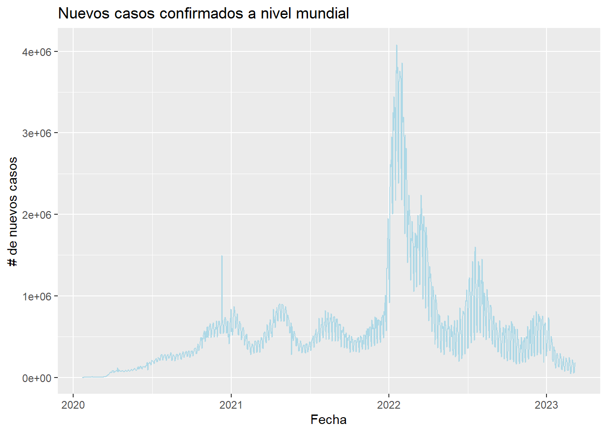
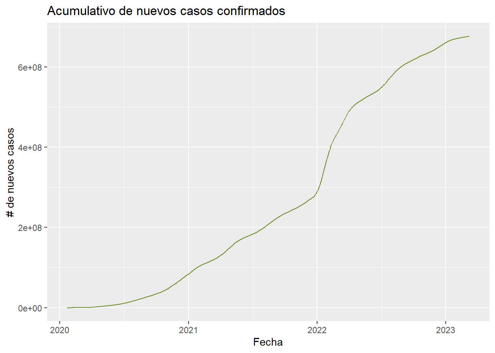
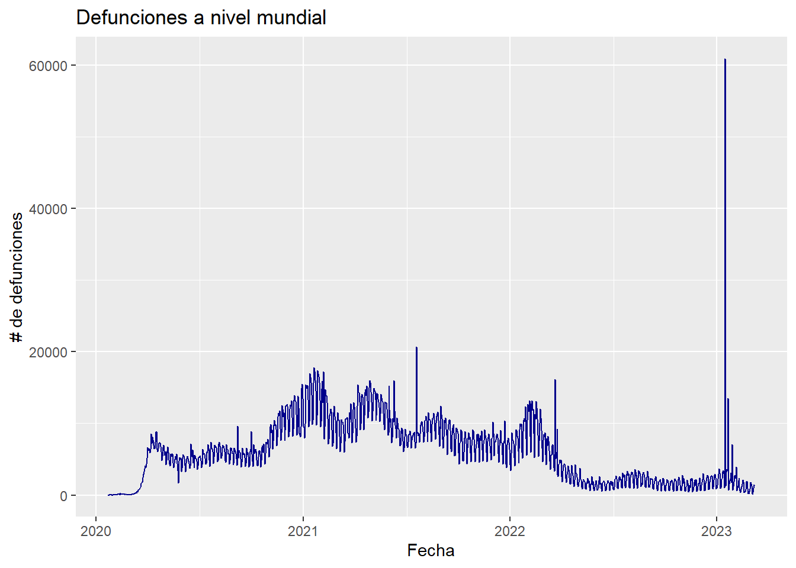
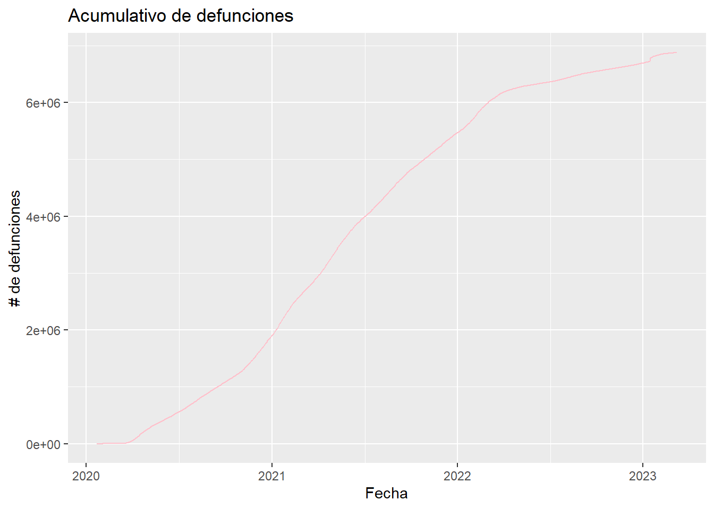
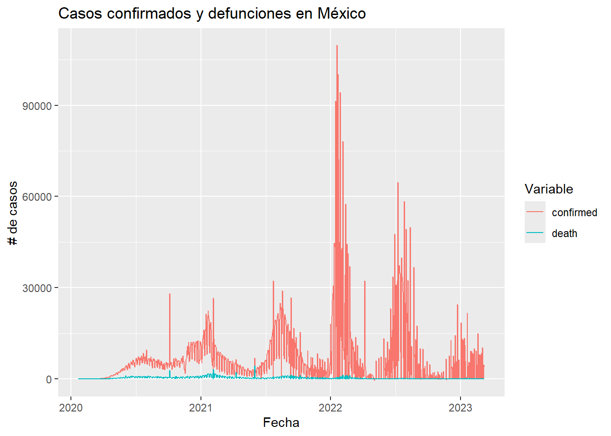
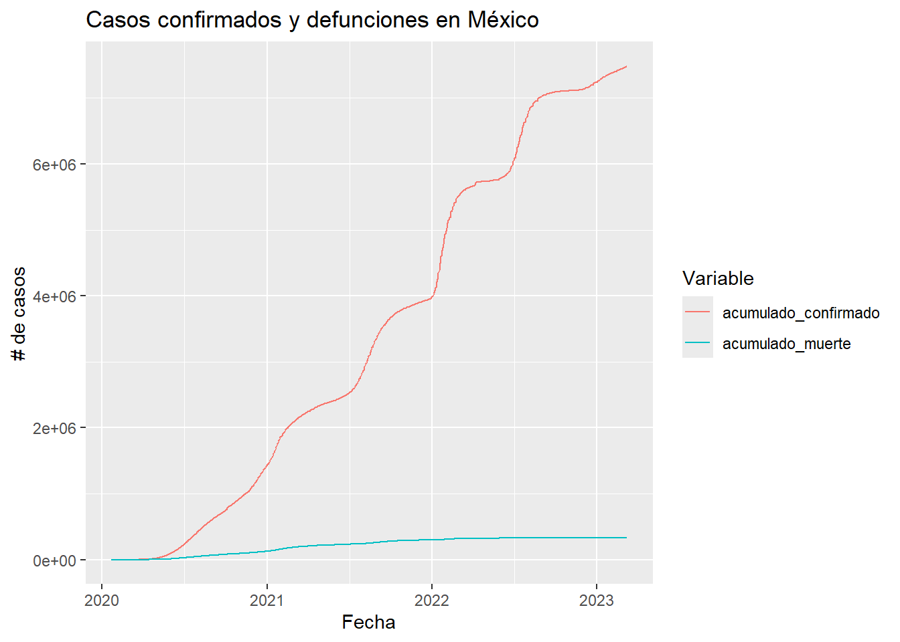

## Chunk de carga de paquetes, definición de variables, etc Realizando cambios .

Este chunk debería marcarse con echo=FALSE y message=FALSE. ¿Tal vez los demás también? Esto ya dependerá de las preferencias personales de cada quien y el cómo quiere presentar sus resultados.


## Antecedentes

Se empieza definiendo un poco de contexto en 3 párrafos:

* ¿Qué es el COVID19? Es un virus, se transmite por vía aerea, causa diversos síntomas, etc...

* ¿Cuál fue la situación en México entre 2020 y 2022? Cuándo se tuvieron los primeros contagios, qué medidas se tomaron, cómo se establecieron los programas de prevención y vacunación, etc...

* ¿Cuál es el contexto de los datos que estamos usando? Se recomienda revisar el github del autor del paquete [https://github.com/RamiKrispin/coronavirus] para acceder a los detalles de los datos. También se puede probar con ??coronavirus en RStudio.

## Materiales y métodos

Se empieza por citar la fuente de los datos:

* Se recomienda revisar el github del autor del paquete [https://github.com/RamiKrispin/coronavirus] para acceder a los detalles de los datos. También se puede probar con ??coronavirus en RStudio.

Escribir un párrafo para definir las ecuaciones usadas para medir el impacto de una enfermedad:

Para medir la tasa de incidencias es: el número de nuevos casos entre la multiplicacion de la población por 100000.
 
 Para medir la tasa de mortalidad es el número de defunciones entre la multiplicacion de la población por 100000.

* $TasaDeIncidencia = NuevosCasos / Población \times 100,000$

* $TasaDeMortalidad = Defunciones / Población \times 100,000$

## Resultados

* Nuevos casos confirmados en el tiempo (línea de tiempo sobre casos a nivel mundial).



* Acumulativo de nuevos casos confirmados en el tiempo.



* Defunciones reportadas a nivel mundial.




* Defunciones acumuladas a nivel mundial



* Casos confirmados y defunciones en México (línea de tiempo sobre casos confirmados en México).



* Casos acumulados en México.



* Tasa de incidencia a nivel mundial por país, por año.
  + Presentar la información en un datatable, para facilitar el acceso a los datos.


```{=html}
<div class="datatables html-widget html-fill-item" id="htmlwidget-af5dbd25d307871a7748" style="width:100%;height:auto;"></div>
<script type="application/json" data-for="htmlwidget-af5dbd25d307871a7748">{"x":{"filter":"none","vertical":false,"data":[["1","2","3","4","5","6","7","8","9","10","11","12","13","14","15","16","17","18","19","20","21","22","23","24","25","26","27","28","29","30","31","32","33","34","35","36","37","38","39","40","41","42","43","44","45","46","47","48","49","50","51","52","53","54","55","56","57","58","59","60","61","62","63","64","65","66","67","68","69","70","71","72","73","74","75","76","77","78","79","80","81","82","83","84","85","86","87","88","89","90","91","92","93","94","95","96","97","98","99","100","101","102","103","104","105","106","107","108","109","110","111","112","113","114","115","116","117","118","119","120","121","122","123","124","125","126","127","128","129","130","131","132","133","134","135","136","137","138","139","140","141","142","143","144","145","146","147","148","149","150","151","152","153","154","155","156","157","158","159","160","161","162","163","164","165","166","167","168","169","170","171","172","173","174","175","176","177","178","179","180","181","182","183","184","185","186","187","188","189","190","191","192","193","194","195","196","197","198","199","200","201","202","203","204","205","206","207","208","209","210","211","212","213","214","215","216","217","218","219","220","221","222","223","224","225","226","227","228","229","230","231","232","233","234","235","236","237","238","239","240","241","242","243","244","245","246","247","248","249","250","251","252","253","254","255","256","257","258","259","260","261","262","263","264","265","266","267","268","269","270","271","272","273","274","275","276","277","278","279","280","281","282","283","284","285","286","287","288","289","290","291","292","293","294","295","296","297","298","299","300","301","302","303","304","305","306","307","308","309","310","311","312","313","314","315","316","317","318","319","320","321","322","323","324","325","326","327","328","329","330","331","332","333","334","335","336","337","338","339","340","341","342","343","344","345","346","347","348","349","350","351","352","353","354","355","356","357","358","359","360","361","362","363","364","365","366","367","368","369","370","371","372","373","374","375","376","377","378","379","380","381","382","383","384","385","386","387","388","389","390","391","392","393","394","395","396","397","398","399","400","401","402","403","404","405","406","407","408","409","410","411","412","413","414","415","416","417","418","419","420","421","422","423","424","425","426","427","428","429","430","431","432","433","434","435","436","437","438","439","440","441","442","443","444","445","446","447","448","449","450","451","452","453","454","455","456","457","458","459","460","461","462","463","464","465","466","467","468","469","470","471","472","473","474","475","476","477","478","479","480","481","482","483","484","485","486","487","488","489","490","491","492","493","494","495","496","497","498","499","500","501","502","503","504","505","506","507","508","509","510","511","512","513","514","515","516","517","518","519","520","521","522","523","524","525","526","527","528","529","530","531","532","533","534","535","536","537","538","539","540","541","542","543","544","545","546","547","548","549","550","551","552","553","554","555","556","557","558","559","560","561","562","563","564","565","566","567","568","569","570","571","572","573","574","575","576","577","578","579","580","581","582","583","584","585","586","587","588","589","590","591","592","593","594","595","596","597","598","599","600","601","602","603","604","605","606","607","608","609","610","611","612","613","614","615","616","617","618","619","620","621","622","623","624","625","626","627","628","629","630","631","632","633","634","635","636","637","638","639","640","641","642","643","644","645","646","647","648","649","650","651","652","653","654","655","656","657","658","659","660","661","662","663","664","665","666","667","668","669","670","671","672","673","674","675","676","677","678","679","680","681","682","683","684","685","686","687","688","689","690","691","692","693","694","695","696","697","698","699","700","701","702","703","704","705","706","707","708","709","710","711","712","713","714","715","716","717","718","719","720","721","722","723","724","725","726","727","728","729","730","731","732","733","734","735","736","737","738","739","740","741","742","743","744","745","746","747","748","749","750","751","752","753","754","755","756","757","758","759","760","761","762","763","764","765","766","767","768"],["2020","2020","2020","2020","2020","2020","2020","2020","2020","2020","2020","2020","2020","2020","2020","2020","2020","2020","2020","2020","2020","2020","2020","2020","2020","2020","2020","2020","2020","2020","2020","2020","2020","2020","2020","2020","2020","2020","2020","2020","2020","2020","2020","2020","2020","2020","2020","2020","2020","2020","2020","2020","2020","2020","2020","2020","2020","2020","2020","2020","2020","2020","2020","2020","2020","2020","2020","2020","2020","2020","2020","2020","2020","2020","2020","2020","2020","2020","2020","2020","2020","2020","2020","2020","2020","2020","2020","2020","2020","2020","2020","2020","2020","2020","2020","2020","2020","2020","2020","2020","2020","2020","2020","2020","2020","2020","2020","2020","2020","2020","2020","2020","2020","2020","2020","2020","2020","2020","2020","2020","2020","2020","2020","2020","2020","2020","2020","2020","2020","2020","2020","2020","2020","2020","2020","2020","2020","2020","2020","2020","2020","2020","2020","2020","2020","2020","2020","2020","2020","2020","2020","2020","2020","2020","2020","2020","2020","2020","2020","2020","2020","2020","2020","2020","2020","2020","2020","2020","2020","2020","2020","2020","2020","2020","2020","2020","2020","2020","2020","2020","2020","2020","2020","2020","2020","2020","2020","2020","2020","2020","2020","2020","2021","2021","2021","2021","2021","2021","2021","2021","2021","2021","2021","2021","2021","2021","2021","2021","2021","2021","2021","2021","2021","2021","2021","2021","2021","2021","2021","2021","2021","2021","2021","2021","2021","2021","2021","2021","2021","2021","2021","2021","2021","2021","2021","2021","2021","2021","2021","2021","2021","2021","2021","2021","2021","2021","2021","2021","2021","2021","2021","2021","2021","2021","2021","2021","2021","2021","2021","2021","2021","2021","2021","2021","2021","2021","2021","2021","2021","2021","2021","2021","2021","2021","2021","2021","2021","2021","2021","2021","2021","2021","2021","2021","2021","2021","2021","2021","2021","2021","2021","2021","2021","2021","2021","2021","2021","2021","2021","2021","2021","2021","2021","2021","2021","2021","2021","2021","2021","2021","2021","2021","2021","2021","2021","2021","2021","2021","2021","2021","2021","2021","2021","2021","2021","2021","2021","2021","2021","2021","2021","2021","2021","2021","2021","2021","2021","2021","2021","2021","2021","2021","2021","2021","2021","2021","2021","2021","2021","2021","2021","2021","2021","2021","2021","2021","2021","2021","2021","2021","2021","2021","2021","2021","2021","2021","2021","2021","2021","2021","2021","2021","2021","2021","2021","2021","2021","2021","2021","2021","2021","2021","2021","2021","2022","2022","2022","2022","2022","2022","2022","2022","2022","2022","2022","2022","2022","2022","2022","2022","2022","2022","2022","2022","2022","2022","2022","2022","2022","2022","2022","2022","2022","2022","2022","2022","2022","2022","2022","2022","2022","2022","2022","2022","2022","2022","2022","2022","2022","2022","2022","2022","2022","2022","2022","2022","2022","2022","2022","2022","2022","2022","2022","2022","2022","2022","2022","2022","2022","2022","2022","2022","2022","2022","2022","2022","2022","2022","2022","2022","2022","2022","2022","2022","2022","2022","2022","2022","2022","2022","2022","2022","2022","2022","2022","2022","2022","2022","2022","2022","2022","2022","2022","2022","2022","2022","2022","2022","2022","2022","2022","2022","2022","2022","2022","2022","2022","2022","2022","2022","2022","2022","2022","2022","2022","2022","2022","2022","2022","2022","2022","2022","2022","2022","2022","2022","2022","2022","2022","2022","2022","2022","2022","2022","2022","2022","2022","2022","2022","2022","2022","2022","2022","2022","2022","2022","2022","2022","2022","2022","2022","2022","2022","2022","2022","2022","2022","2022","2022","2022","2022","2022","2022","2022","2022","2022","2022","2022","2022","2022","2022","2022","2022","2022","2022","2022","2022","2022","2022","2022","2022","2022","2022","2022","2022","2022","2023","2023","2023","2023","2023","2023","2023","2023","2023","2023","2023","2023","2023","2023","2023","2023","2023","2023","2023","2023","2023","2023","2023","2023","2023","2023","2023","2023","2023","2023","2023","2023","2023","2023","2023","2023","2023","2023","2023","2023","2023","2023","2023","2023","2023","2023","2023","2023","2023","2023","2023","2023","2023","2023","2023","2023","2023","2023","2023","2023","2023","2023","2023","2023","2023","2023","2023","2023","2023","2023","2023","2023","2023","2023","2023","2023","2023","2023","2023","2023","2023","2023","2023","2023","2023","2023","2023","2023","2023","2023","2023","2023","2023","2023","2023","2023","2023","2023","2023","2023","2023","2023","2023","2023","2023","2023","2023","2023","2023","2023","2023","2023","2023","2023","2023","2023","2023","2023","2023","2023","2023","2023","2023","2023","2023","2023","2023","2023","2023","2023","2023","2023","2023","2023","2023","2023","2023","2023","2023","2023","2023","2023","2023","2023","2023","2023","2023","2023","2023","2023","2023","2023","2023","2023","2023","2023","2023","2023","2023","2023","2023","2023","2023","2023","2023","2023","2023","2023","2023","2023","2023","2023","2023","2023","2023","2023","2023","2023","2023","2023","2023","2023","2023","2023","2023","2023","2023","2023","2023","2023","2023","2023"],["Afghanistan","Albania","Algeria","Andorra","Angola","Antigua and Barbuda","Argentina","Armenia","Australia","Austria","Azerbaijan","Bahamas","Bahrain","Bangladesh","Barbados","Belarus","Belgium","Belize","Benin","Bhutan","Bolivia","Bosnia and Herzegovina","Botswana","Brazil","Brunei","Bulgaria","Burkina Faso","Burma","Burundi","Cabo Verde","Cambodia","Cameroon","Canada","Central African Republic","Chad","Chile","China","Colombia","Comoros","Congo (Brazzaville)","Congo (Kinshasa)","Costa Rica","Cote d'Ivoire","Croatia","Cuba","Cyprus","Czechia","Denmark","Djibouti","Dominica","Dominican Republic","Ecuador","Egypt","El Salvador","Equatorial Guinea","Eritrea","Estonia","Eswatini","Ethiopia","Fiji","Finland","France","Gabon","Gambia","Georgia","Germany","Ghana","Greece","Grenada","Guatemala","Guinea","Guinea-Bissau","Guyana","Haiti","Holy See","Honduras","Hungary","Iceland","India","Indonesia","Iran","Iraq","Ireland","Israel","Italy","Jamaica","Japan","Jordan","Kazakhstan","Kenya","Kiribati","Korea, South","Kosovo","Kuwait","Kyrgyzstan","Laos","Latvia","Lebanon","Lesotho","Liberia","Libya","Liechtenstein","Lithuania","Luxembourg","Madagascar","Malawi","Malaysia","Maldives","Mali","Malta","Marshall Islands","Mauritania","Mauritius","Mexico","Micronesia","Moldova","Monaco","Mongolia","Montenegro","Morocco","Mozambique","Namibia","Nepal","Netherlands","New Zealand","Nicaragua","Niger","Nigeria","North Macedonia","Norway","Oman","Pakistan","Palau","Panama","Papua New Guinea","Paraguay","Peru","Philippines","Poland","Portugal","Qatar","Romania","Russia","Rwanda","Saint Kitts and Nevis","Saint Lucia","Saint Vincent and the Grenadines","Samoa","San Marino","Sao Tome and Principe","Saudi Arabia","Senegal","Serbia","Seychelles","Sierra Leone","Singapore","Slovakia","Slovenia","Solomon Islands","Somalia","South Africa","South Sudan","Spain","Sri Lanka","Sudan","Suriname","Sweden","Switzerland","Syria","Taiwan*","Tajikistan","Tanzania","Thailand","Timor-Leste","Togo","Trinidad and Tobago","Tunisia","Turkey","US","Uganda","Ukraine","United Arab Emirates","United Kingdom","Uruguay","Uzbekistan","Vanuatu","Venezuela","Vietnam","West Bank and Gaza","Yemen","Zambia","Zimbabwe","Afghanistan","Albania","Algeria","Andorra","Angola","Antigua and Barbuda","Argentina","Armenia","Australia","Austria","Azerbaijan","Bahamas","Bahrain","Bangladesh","Barbados","Belarus","Belgium","Belize","Benin","Bhutan","Bolivia","Bosnia and Herzegovina","Botswana","Brazil","Brunei","Bulgaria","Burkina Faso","Burma","Burundi","Cabo Verde","Cambodia","Cameroon","Canada","Central African Republic","Chad","Chile","China","Colombia","Comoros","Congo (Brazzaville)","Congo (Kinshasa)","Costa Rica","Cote d'Ivoire","Croatia","Cuba","Cyprus","Czechia","Denmark","Djibouti","Dominica","Dominican Republic","Ecuador","Egypt","El Salvador","Equatorial Guinea","Eritrea","Estonia","Eswatini","Ethiopia","Fiji","Finland","France","Gabon","Gambia","Georgia","Germany","Ghana","Greece","Grenada","Guatemala","Guinea","Guinea-Bissau","Guyana","Haiti","Holy See","Honduras","Hungary","Iceland","India","Indonesia","Iran","Iraq","Ireland","Israel","Italy","Jamaica","Japan","Jordan","Kazakhstan","Kenya","Kiribati","Korea, South","Kosovo","Kuwait","Kyrgyzstan","Laos","Latvia","Lebanon","Lesotho","Liberia","Libya","Liechtenstein","Lithuania","Luxembourg","Madagascar","Malawi","Malaysia","Maldives","Mali","Malta","Marshall Islands","Mauritania","Mauritius","Mexico","Micronesia","Moldova","Monaco","Mongolia","Montenegro","Morocco","Mozambique","Namibia","Nepal","Netherlands","New Zealand","Nicaragua","Niger","Nigeria","North Macedonia","Norway","Oman","Pakistan","Palau","Panama","Papua New Guinea","Paraguay","Peru","Philippines","Poland","Portugal","Qatar","Romania","Russia","Rwanda","Saint Kitts and Nevis","Saint Lucia","Saint Vincent and the Grenadines","Samoa","San Marino","Sao Tome and Principe","Saudi Arabia","Senegal","Serbia","Seychelles","Sierra Leone","Singapore","Slovakia","Slovenia","Solomon Islands","Somalia","South Africa","South Sudan","Spain","Sri Lanka","Sudan","Suriname","Sweden","Switzerland","Syria","Taiwan*","Tajikistan","Tanzania","Thailand","Timor-Leste","Togo","Trinidad and Tobago","Tunisia","Turkey","US","Uganda","Ukraine","United Arab Emirates","United Kingdom","Uruguay","Uzbekistan","Vanuatu","Venezuela","Vietnam","West Bank and Gaza","Yemen","Zambia","Zimbabwe","Afghanistan","Albania","Algeria","Andorra","Angola","Antigua and Barbuda","Argentina","Armenia","Australia","Austria","Azerbaijan","Bahamas","Bahrain","Bangladesh","Barbados","Belarus","Belgium","Belize","Benin","Bhutan","Bolivia","Bosnia and Herzegovina","Botswana","Brazil","Brunei","Bulgaria","Burkina Faso","Burma","Burundi","Cabo Verde","Cambodia","Cameroon","Canada","Central African Republic","Chad","Chile","China","Colombia","Comoros","Congo (Brazzaville)","Congo (Kinshasa)","Costa Rica","Cote d'Ivoire","Croatia","Cuba","Cyprus","Czechia","Denmark","Djibouti","Dominica","Dominican Republic","Ecuador","Egypt","El Salvador","Equatorial Guinea","Eritrea","Estonia","Eswatini","Ethiopia","Fiji","Finland","France","Gabon","Gambia","Georgia","Germany","Ghana","Greece","Grenada","Guatemala","Guinea","Guinea-Bissau","Guyana","Haiti","Holy See","Honduras","Hungary","Iceland","India","Indonesia","Iran","Iraq","Ireland","Israel","Italy","Jamaica","Japan","Jordan","Kazakhstan","Kenya","Kiribati","Korea, South","Kosovo","Kuwait","Kyrgyzstan","Laos","Latvia","Lebanon","Lesotho","Liberia","Libya","Liechtenstein","Lithuania","Luxembourg","Madagascar","Malawi","Malaysia","Maldives","Mali","Malta","Marshall Islands","Mauritania","Mauritius","Mexico","Micronesia","Moldova","Monaco","Mongolia","Montenegro","Morocco","Mozambique","Namibia","Nepal","Netherlands","New Zealand","Nicaragua","Niger","Nigeria","North Macedonia","Norway","Oman","Pakistan","Palau","Panama","Papua New Guinea","Paraguay","Peru","Philippines","Poland","Portugal","Qatar","Romania","Russia","Rwanda","Saint Kitts and Nevis","Saint Lucia","Saint Vincent and the Grenadines","Samoa","San Marino","Sao Tome and Principe","Saudi Arabia","Senegal","Serbia","Seychelles","Sierra Leone","Singapore","Slovakia","Slovenia","Solomon Islands","Somalia","South Africa","South Sudan","Spain","Sri Lanka","Sudan","Suriname","Sweden","Switzerland","Syria","Taiwan*","Tajikistan","Tanzania","Thailand","Timor-Leste","Togo","Trinidad and Tobago","Tunisia","Turkey","US","Uganda","Ukraine","United Arab Emirates","United Kingdom","Uruguay","Uzbekistan","Vanuatu","Venezuela","Vietnam","West Bank and Gaza","Yemen","Zambia","Zimbabwe","Afghanistan","Albania","Algeria","Andorra","Angola","Antigua and Barbuda","Argentina","Armenia","Australia","Austria","Azerbaijan","Bahamas","Bahrain","Bangladesh","Barbados","Belarus","Belgium","Belize","Benin","Bhutan","Bolivia","Bosnia and Herzegovina","Botswana","Brazil","Brunei","Bulgaria","Burkina Faso","Burma","Burundi","Cabo Verde","Cambodia","Cameroon","Canada","Central African Republic","Chad","Chile","China","Colombia","Comoros","Congo (Brazzaville)","Congo (Kinshasa)","Costa Rica","Cote d'Ivoire","Croatia","Cuba","Cyprus","Czechia","Denmark","Djibouti","Dominica","Dominican Republic","Ecuador","Egypt","El Salvador","Equatorial Guinea","Eritrea","Estonia","Eswatini","Ethiopia","Fiji","Finland","France","Gabon","Gambia","Georgia","Germany","Ghana","Greece","Grenada","Guatemala","Guinea","Guinea-Bissau","Guyana","Haiti","Holy See","Honduras","Hungary","Iceland","India","Indonesia","Iran","Iraq","Ireland","Israel","Italy","Jamaica","Japan","Jordan","Kazakhstan","Kenya","Kiribati","Korea, South","Kosovo","Kuwait","Kyrgyzstan","Laos","Latvia","Lebanon","Lesotho","Liberia","Libya","Liechtenstein","Lithuania","Luxembourg","Madagascar","Malawi","Malaysia","Maldives","Mali","Malta","Marshall Islands","Mauritania","Mauritius","Mexico","Micronesia","Moldova","Monaco","Mongolia","Montenegro","Morocco","Mozambique","Namibia","Nepal","Netherlands","New Zealand","Nicaragua","Niger","Nigeria","North Macedonia","Norway","Oman","Pakistan","Palau","Panama","Papua New Guinea","Paraguay","Peru","Philippines","Poland","Portugal","Qatar","Romania","Russia","Rwanda","Saint Kitts and Nevis","Saint Lucia","Saint Vincent and the Grenadines","Samoa","San Marino","Sao Tome and Principe","Saudi Arabia","Senegal","Serbia","Seychelles","Sierra Leone","Singapore","Slovakia","Slovenia","Solomon Islands","Somalia","South Africa","South Sudan","Spain","Sri Lanka","Sudan","Suriname","Sweden","Switzerland","Syria","Taiwan*","Tajikistan","Tanzania","Thailand","Timor-Leste","Togo","Trinidad and Tobago","Tunisia","Turkey","US","Uganda","Ukraine","United Arab Emirates","United Kingdom","Uruguay","Uzbekistan","Vanuatu","Venezuela","Vietnam","West Bank and Gaza","Yemen","Zambia","Zimbabwe"],[52330,58316,99610,8049,17553,159,1625514,159409,28425,356063,218700,7871,92675,513510,383,194284,646496,10776,3251,670,160124,110985,14805,7681032,157,202266,6707,124630,818,11840,378,26277,590249,4963,2113,608973,102571,1642775,823,7107,17658,169321,22490,210837,11863,22346,718661,164116,5831,88,170785,212512,138062,46242,5277,1320,27990,9358,124264,49,36422,2677660,9571,3797,227420,1719737,54771,138850,127,138012,13722,2452,6332,9999,27,121827,322514,5754,10286709,743198,1225142,595291,91779,423262,2107166,12827,235749,294494,201196,96458,0,61769,51144,150584,81034,41,40904,181503,3094,1800,100277,2221,145052,46415,17714,6583,113010,13757,7090,12774,4,14364,527,1426094,0,144818,875,1195,48247,439193,18642,23941,260593,816565,2162,4829,3323,87607,83329,49567,128867,482178,0,246790,780,107932,1015137,474064,1294878,413678,143834,632263,3127347,8383,32,353,121,2,2333,1014,362741,19140,337923,226,2611,58599,274603,122152,17,4714,1057161,3558,1928265,43299,25500,6210,437379,452296,11434,799,13665,509,6884,44,3633,7150,139140,2208652,20219878,35216,1086997,207822,2496187,19119,77060,1,113558,1465,138004,2099,20725,13867,105754,151908,118822,15691,64040,4124,4028894,185521,397071,914748,398247,16605,189387,1072029,28182,504826,1458847,22064,21684,1990,439629,180328,204704,14610807,15313,544842,10925,406204,26548,29892,120115,83090,1633486,7200,3590,1197521,25325,3514665,5692,12982,57135,401235,48514,504408,954141,144481,1757068,646656,7825,6726,247993,336906,247513,75703,8433,6691,213418,56751,296078,53283,234407,7400123,32227,6373,707321,5389445,88215,1072003,6054,490347,18329,4032,33241,16170,0,257575,933901,21305,24574870,3519522,4969259,1498449,696780,960670,4018517,81093,1497558,768911,871322,198570,2,573484,110340,266551,103655,111019,235770,546427,25314,4478,288457,3910,379375,57351,32565,68492,2645076,81943,13918,39699,0,27109,67953,2553629,1,231337,4110,691426,121787,523899,170438,124033,567838,2382139,11958,8734,4082,153906,141720,344692,176622,813755,10,249130,35378,358169,1281694,2369915,2813337,975968,106694,1176628,7193058,103403,2967,13217,5729,1,5869,2883,193495,55915,961416,24562,4453,220806,1096479,341896,7,18818,2401125,11684,4366480,543946,21018,46236,877405,880319,38844,16230,3828,28797,2216551,19793,26530,84749,587566,7273898,34687839,105521,2760229,554115,10514666,394264,121843,6,331077,1729792,331744,8027,233549,199391,49475,123582,52796,24011,23502,4823,4236731,101046,10706211,4434282,209454,13015,416675,451586,76950,294927,2562905,37106,3047,59864,561265,109679,108351,14039442,251349,544996,4374,102849,24356,21468,18091,14626,2281407,3188,1947,3231033,4456309,1179220,2467,5286,20380,591131,16937,548656,145989,464284,2104146,2621693,2034,8946,236762,491045,130070,79840,3476,2178,370483,7912,77659,15370,1167376,29420405,7182,2416,874079,30260684,28062,4337634,13463,575773,6159,2463,32590,7724,2,86513,929401,180915,9818294,2457095,1366739,371367,899109,3379744,19018022,58838,27501370,683592,415788,47471,3428,28481547,110799,245612,21868,106737,697156,494585,6082,1765,118408,15145,763947,207980,17456,13145,2268591,89978,11762,63911,15543,21952,221500,3254744,22202,220395,10963,314645,114722,308503,41890,22321,172569,5482833,2087124,1802,2068,24868,120554,1080818,93665,279839,5961,527858,10505,326114,2161812,1220464,2260264,4164412,238900,1499589,11170110,21134,3563,16171,3688,15979,14806,2382,270768,13845,1146914,25567,696,1922809,1286210,843394,24551,3768,590916,3126,7389513,84646,17168,29135,1360078,3066901,7145,8830331,293,13045,2498373,3549,9180,94134,420865,7437088,45857616,29248,1815506,285071,11354835,598605,50314,12006,105887,9793974,233480,1819,80151,46723,1892,651,268,139,193,0,153818,1332,267753,256050,2424,0,11956,746,1283,0,71117,811,17,103,33259,737,1898,744772,12842,5419,50,267,1909,44,135,399,111953,17,29,154759,319319,22433,26,-288,576,48038,322,5425,650,19574,38381,18571,0,0,5250,16658,114,0,43,0,3542,246,2115,196,25439,368530,1,12,18717,879194,181,0,36,34115,57,13,912,309,0,6335,10988,1163,10865,18410,11171,438,16834,40148,459805,1658,4085761,0,10362,438,1584,1498722,1029,1113,151,226,2425,10313,300,47,45,156,19074,5621,154,487,18041,60,292,1226,102,243,6062,248977,1745,14590,173,634,4052,895,2244,861,154,31298,134870,290,35,217,1249,4429,295,1639,20,7953,162,16186,28910,13009,76481,16415,5662,37566,585343,274,35,263,51,625,608,2,3123,26,53889,310,0,33080,10259,24265,0,24,17865,0,86171,148,143,886,24477,14395,44,1123577,0,555,6374,33,53,3885,3555,123084,3037369,559,49197,6205,293017,22315,2030,1,1640,1763,0,0,8710,4295],[38928341,2877800,43851043,77265,32866268,97928,45195777,2963234,25459700,9006400,10139175,393248,1701583,164689383,287371,9449321,11589616,397621,12123198,771612,11673029,3280815,2351625,212559409,437483,6948445,20903278,54409794,11890781,555988,16718971,26545864,37894482,4829764,16425859,19116209,1404676330,50882884,869595,5518092,89561404,5094114,26378275,4105268,11326616,1207361,10708982,5897840,988002,71991,10847904,17643060,102334403,6486201,1402985,3546427,1326539,1160164,114963583,896444,5540718,68151730,2225728,2416664,3989175,83783945,31072945,10423056,112519,17915567,13132792,1967998,786559,11402533,809,9904608,9660350,341250,1380004385,273523621,83992953,40222503,4937796,8655541,60461828,2961161,126476458,10203140,18776707,53771300,117606,51269183,1810366,4270563,6524191,7275556,1886202,6825442,2142252,5057677,6871287,38137,2722291,625976,27691019,19129955,32365998,540542,20250834,441539,58413,4649660,1271767,127792286,113815,4033963,39244,3278292,628062,36910558,31255435,2540916,29136808,17474842,4839692,6624554,24206636,206139587,2083380,5421242,5106622,220892331,18008,4314768,8947027,7132530,32971846,109581085,37846605,10196707,2881060,19237682,145934460,12952209,53192,183629,110947,196130,33938,219161,34813867,16743930,8737370,98340,7976985,5850343,5459643,2078932,652858,15893219,59308690,11193729,46754783,21413250,43849269,586634,10099270,8654618,17500657,23816775,9537642,59734213,69799978,1318442,8278737,1399491,11818618,84339067,329466283,45741000,43733759,9890400,68401319,3473727,33469199,292680,28435943,97338583,5101416,29825968,18383956,14862927,38928341,2877800,43851043,77265,32866268,97928,45195777,2963234,25459700,9006400,10139175,393248,1701583,164689383,287371,9449321,11589616,397621,12123198,771612,11673029,3280815,2351625,212559409,437483,6948445,20903278,54409794,11890781,555988,16718971,26545864,37894482,4829764,16425859,19116209,1404676330,50882884,869595,5518092,89561404,5094114,26378275,4105268,11326616,1207361,10708982,5897840,988002,71991,10847904,17643060,102334403,6486201,1402985,3546427,1326539,1160164,114963583,896444,5540718,68151730,2225728,2416664,3989175,83783945,31072945,10423056,112519,17915567,13132792,1967998,786559,11402533,809,9904608,9660350,341250,1380004385,273523621,83992953,40222503,4937796,8655541,60461828,2961161,126476458,10203140,18776707,53771300,117606,51269183,1810366,4270563,6524191,7275556,1886202,6825442,2142252,5057677,6871287,38137,2722291,625976,27691019,19129955,32365998,540542,20250834,441539,58413,4649660,1271767,127792286,113815,4033963,39244,3278292,628062,36910558,31255435,2540916,29136808,17474842,4839692,6624554,24206636,206139587,2083380,5421242,5106622,220892331,18008,4314768,8947027,7132530,32971846,109581085,37846605,10196707,2881060,19237682,145934460,12952209,53192,183629,110947,196130,33938,219161,34813867,16743930,8737370,98340,7976985,5850343,5459643,2078932,652858,15893219,59308690,11193729,46754783,21413250,43849269,586634,10099270,8654618,17500657,23816775,9537642,59734213,69799978,1318442,8278737,1399491,11818618,84339067,329466283,45741000,43733759,9890400,68401319,3473727,33469199,292680,28435943,97338583,5101416,29825968,18383956,14862927,38928341,2877800,43851043,77265,32866268,97928,45195777,2963234,25459700,9006400,10139175,393248,1701583,164689383,287371,9449321,11589616,397621,12123198,771612,11673029,3280815,2351625,212559409,437483,6948445,20903278,54409794,11890781,555988,16718971,26545864,37894482,4829764,16425859,19116209,1404676330,50882884,869595,5518092,89561404,5094114,26378275,4105268,11326616,1207361,10708982,5897840,988002,71991,10847904,17643060,102334403,6486201,1402985,3546427,1326539,1160164,114963583,896444,5540718,68151730,2225728,2416664,3989175,83783945,31072945,10423056,112519,17915567,13132792,1967998,786559,11402533,809,9904608,9660350,341250,1380004385,273523621,83992953,40222503,4937796,8655541,60461828,2961161,126476458,10203140,18776707,53771300,117606,51269183,1810366,4270563,6524191,7275556,1886202,6825442,2142252,5057677,6871287,38137,2722291,625976,27691019,19129955,32365998,540542,20250834,441539,58413,4649660,1271767,127792286,113815,4033963,39244,3278292,628062,36910558,31255435,2540916,29136808,17474842,4839692,6624554,24206636,206139587,2083380,5421242,5106622,220892331,18008,4314768,8947027,7132530,32971846,109581085,37846605,10196707,2881060,19237682,145934460,12952209,53192,183629,110947,196130,33938,219161,34813867,16743930,8737370,98340,7976985,5850343,5459643,2078932,652858,15893219,59308690,11193729,46754783,21413250,43849269,586634,10099270,8654618,17500657,23816775,9537642,59734213,69799978,1318442,8278737,1399491,11818618,84339067,329466283,45741000,43733759,9890400,68401319,3473727,33469199,292680,28435943,97338583,5101416,29825968,18383956,14862927,38928341,2877800,43851043,77265,32866268,97928,45195777,2963234,25459700,9006400,10139175,393248,1701583,164689383,287371,9449321,11589616,397621,12123198,771612,11673029,3280815,2351625,212559409,437483,6948445,20903278,54409794,11890781,555988,16718971,26545864,37894482,4829764,16425859,19116209,1404676330,50882884,869595,5518092,89561404,5094114,26378275,4105268,11326616,1207361,10708982,5897840,988002,71991,10847904,17643060,102334403,6486201,1402985,3546427,1326539,1160164,114963583,896444,5540718,68151730,2225728,2416664,3989175,83783945,31072945,10423056,112519,17915567,13132792,1967998,786559,11402533,809,9904608,9660350,341250,1380004385,273523621,83992953,40222503,4937796,8655541,60461828,2961161,126476458,10203140,18776707,53771300,117606,51269183,1810366,4270563,6524191,7275556,1886202,6825442,2142252,5057677,6871287,38137,2722291,625976,27691019,19129955,32365998,540542,20250834,441539,58413,4649660,1271767,127792286,113815,4033963,39244,3278292,628062,36910558,31255435,2540916,29136808,17474842,4839692,6624554,24206636,206139587,2083380,5421242,5106622,220892331,18008,4314768,8947027,7132530,32971846,109581085,37846605,10196707,2881060,19237682,145934460,12952209,53192,183629,110947,196130,33938,219161,34813867,16743930,8737370,98340,7976985,5850343,5459643,2078932,652858,15893219,59308690,11193729,46754783,21413250,43849269,586634,10099270,8654618,17500657,23816775,9537642,59734213,69799978,1318442,8278737,1399491,11818618,84339067,329466283,45741000,43733759,9890400,68401319,3473727,33469199,292680,28435943,97338583,5101416,29825968,18383956,14862927],[134.4264837795168,2026.409062478282,227.1553723362977,10417.39468064453,53.40734153327053,162.3641859325218,3596.605939532802,5379.561654597645,111.6470343326905,3953.444217445372,2156.980227681246,2001.535926438278,5446.399029609487,311.8051635423274,133.2771922010224,2056.063075854868,5578.234861275818,2710.11842935861,26.81635654222591,86.83120532080891,1371.74335812924,3382.848469054183,629.5646627332164,3613.593035535773,35.88710875622596,2910.953457931955,32.08587667446226,229.0580258399802,6.879278997737828,2129.542364223688,2.260904693237401,98.9871717869119,1557.612002718496,102.7586441076624,12.8638630101476,3185.636859274765,7.302109233947154,3228.541448240238,94.6417585197707,128.7945181051711,19.71608216414294,3323.855728395556,85.25955544856515,5135.767019351721,104.7356068220199,1850.813468382696,6710.824614328421,2782.645850006104,590.1809915364544,122.237501909961,1574.359433859297,1204.50760809066,134.9125963044901,712.9288777822334,376.1266157514157,37.22056029914052,2110.00204291016,806.6100999513862,108.0898809495177,5.466041381279813,657.3516284351595,3928.968494270065,430.0166058026857,157.1174147502508,5700.928136770134,2052.585373009113,176.2658801732504,1332.142895519318,112.8698264293142,770.3468162631973,104.4865402573954,124.5936225544945,805.0254335656957,87.69104198163689,3337.453646477132,1230.00324697353,3338.533282955586,1686.153846153846,745.4113270806745,271.7125479996479,1458.624749150086,1479.99491727305,1858.703761759295,4890.069840810644,3485.117916051099,433.1746906027738,186.3975349467804,2886.307548460572,1071.519090115215,179.3856574046006,0,120.4797821724602,2825.064103059823,3526.092461345261,1242.054378849424,0.5635308146896265,2168.590638754492,2659.212399724443,144.4274529793881,35.58946132779931,1459.362707452039,5823.740724231061,5328.306195039399,7414.821015502192,63.97019914651751,34.41199940093952,349.1627231763408,2545.038128397053,35.01090374845796,2893.06267396538,6.847790731515246,308.925813930481,41.43840813608153,1115.946857700002,0,3589.968475169455,2229.640199775762,36.45190849381324,7681.884909451615,1189.884476956431,59.64402671087445,942.2192626596078,894.3773113376043,4672.803336362069,44.67226426805673,72.89547341602166,13.72764063540262,42.49887237816189,3999.702406666091,914.310779706938,2523.527294559887,218.2864374770892,0,5719.658623592277,8.717979726673452,1513.235836372227,3078.799409653921,432.6148075646449,3421.384824345539,4056.976433666281,4992.398631059402,3286.586190581589,2142.980485897574,64.72255041591747,60.15942246954429,192.2354312227372,109.0610832199158,1.01973181053383,6874.300194472273,462.6735596205529,1041.944004669174,114.3100813249936,3867.559689013971,229.814927801505,32.73166490848359,1001.633579432864,5029.687838563804,5875.709258407683,2.60393531211994,29.66044827042275,1782.472349330258,31.78565427124419,4124.209067551442,202.2065777030577,58.15376306501255,1058.581671024864,4330.798166600161,5226.065436972493,65.33469000620948,3.354778302268044,143.2744068187923,0.852107987092757,9.862467291895134,3.337272325972625,43.88350541876134,510.9000343696387,1177.295010296466,2618.776894935297,6137.16153771037,76.99000896351194,2485.487241103606,2101.249696675564,3649.325826596999,550.3886747576881,230.2415423805033,0.3416700833675003,399.3467000549269,1.505055811219278,2705.209690799574,7.037491624747938,112.7341688589768,93.29925390873547,271.6632594232567,5278.615609145875,270.9673291009292,20308.03080308031,194.8502336803193,4211.257250224655,8914.315158250294,6260.761046883237,1559.605965506271,10156.64416414994,3927.804777015881,4222.526242981528,11130.04772614677,650.9399576777818,9806.835066864784,5342.457939570472,12587.53525569786,5549.002693519708,178.8636958663877,257.9016396841936,3766.19470404811,5496.439146980248,8704.789241481954,6873.752175327134,3500.250295440052,7841.207637104417,52.26452999381245,746.5641204228783,223.2654019950414,5376.375029676899,718.4353630375937,313.0054459707923,4310.61704445518,149.0756070068848,21.85578239774249,6264.427219853058,1.802906438951669,6907.362011948851,654.5575814028369,235.2624784073915,63.79422100171632,7876.443283365861,183.9164994678386,12286.84704628297,8423.884062106459,11966.67773764433,16407.42322659614,10964.28522984686,792.0024453391794,9342.834520981789,2286.091396089051,1909.566707815991,241.8668529292148,1167.139285384465,601.0755638869981,188.66876436481,16088.3321183923,4891.636010081334,257.5406857317591,5943.818018749637,4230.62498398222,10858.30543113139,1447.930744457544,263.7106358186326,17731.00954458002,6432.551009623621,283.8964893736336,10284.92027674033,5380.424639394236,2736.988452556372,139.5666664026964,204.8782569900986,4226.129254130968,141.8105959439012,0,2600.557235581661,9667.361948583643,6243.223443223444,1780.782022660022,1286.734208596924,5916.28085751432,3725.399684848056,14111.1540452461,11098.90184796075,6646.370334684555,2738.554235990545,1184.060673172868,7536.023224223131,4640.440946327809,369.2862177406907,1.70059350713399,1118.574485573527,6094.90014726304,6241.589223715936,1588.77935977043,1525.917744293357,12499.72166289719,8005.73794341817,1181.653699004599,88.53867101438071,4198.005410049092,10252.51068516139,13935.87239571376,9161.852850588521,117.6013060407781,358.0353430000227,8172.391285447153,15159.41406958201,68.72803362073878,8991.051753072776,0,583.0318775996524,5343.195726890224,1998.265372606293,0.8786188112287484,5734.732817331245,10472.93853837529,21091.04375083122,19390.92000471291,1419.374369794139,545.3067602482577,4881.428587170926,1948.868249397806,13631.81996151954,247.0818390922397,131.8428380235107,16.86314446997096,74.66105964401685,6802.407626069176,6358.174012523329,3458.68560469132,368.3944102160795,55.53087516659262,5773.890971658268,395.4162650900685,5021.6262672572,3887.237614782017,2162.70444849127,7433.525411328176,9571.403787516891,3703.28976140726,6116.267022191135,4928.964687298669,798.3425838789353,5577.906452098059,7197.664856858121,5163.726824519816,0.5098659052669148,17293.29954623136,1315.47127454246,555.7986419606877,333.9419120839612,11003.49418646572,24976.61175513524,55.82309606950496,3774.240245400996,20083.34610889393,16445.75195340685,1.07220865793174,118.4026974019549,4048.521388686886,104.379871980106,9339.108685415138,2540.230931782891,47.93238400393859,7881.575224074977,8687.80614836518,10171.66788875026,221.9573813714537,68.14524636521946,40.13570649852448,48.20855344658178,3175.575499465057,1501.241616999459,320.4595097054055,6055.70168011084,4971.528820036318,8624.589124278551,10528.49435278936,230.6923766423996,6311.437807118295,5602.553991749575,15372.02228512582,11349.88443248419,364.0451628376287,2.050020500205002,1164.290560014134,1777.08771453967,6502.978780793412,26.91278955304988,1270.39577335803,1341.532525861158,127.09249541356,4294.32205156717,120.3985045464027,31076.16644017343,71.50796677006346,4925.046973286496,9374.174494223211,3409.990571112507,42051.59919402035,49234.78859477705,2065.789376354585,3309.616323541378,24487.49194132757,274.2046826418677,26777.23221897825,3121.144894961236,22113.80428825252,9332.002082384985,25.13363223136338,7758.30339600732,4808.220728313106,3343.041286997286,4607.494817413491,6604.949677856886,57453.43247623336,7843.423960324935,20.92494775221379,189.0266300217935,204.8309526514701,3861.234415131261,108.2064201199942,55.09709535165252,6020.420070658309,66.00736599138177,11.85326137281466,16902.05939891115,317.2481022727848,2317.518008609732,283.6952834365423,95.79398096298503,22.75533777920677,11604.19652956333,64.20814097965086,13364.68167242674,1288.902175195133,38454.44734424915,19648.4222309833,44451.74843671582,205.8700286031809,12426.5533191649,2182.559875161137,2783.219010761172,127.1029059504065,1230.92084257025,247.7574599870989,61.41392449358185,27928.54186721989,681.9725487086308,67.55095654943183,1714.552163883076,21069.03834484989,43168.97751531766,322.6809385513414,99.97252410761281,21911.27238088076,36117.52108354411,90.31007521173163,41615.76029141549,11965.09034029808,3213.813997625641,46.89787213564335,125.1525662119575,4143.363689182884,67.73933476009233,247.2187886279357,873.4621299500192,9620.779785411502,53015.38461538462,711.4683189937834,898.3118134429786,1627.206749118584,923.2816764287394,18208.71093094976,39047.17221026392,31454.59313601964,1986.990913361347,21744.26010570283,6699.819859376624,2214.381893481109,88.28315476843595,2914.817271227659,55552.95663673829,6120.254136456385,5751.279163894784,335.183320046884,1467.063135793333,36960.8345235558,7246.197389121467,283.9068419588359,34.8974440242032,1723.228850723307,39712.0906206571,28062.65017222626,33224.91597121934,63.03848912168959,68.71422332148717,7009.179818895125,16645.88505611035,58.08155851754056,14474.59907278859,26608.80283498536,472.1205421471678,17416.71233803047,2546.901774650154,19507.09484690067,5463.485907034844,27935.48058301906,9597.833261954702,18266.03106062777,835.812343991115,134.0246904258412,878.4627276147656,592.2714663871211,31375.57981926246,43125.14102137079,27.20183124780929,8.543111897084749,12.06367023525666,5786.462383242615,19936.7229870941,1834.1870614273,126.6857019133,33101.95468680586,12233.75161769995,117.4133038829546,4572.206496152137,6556.539175877504,1113.754257863025,5972.171083773565,40840.75378453063,8292.086940223389,7795.060756280304,7654.196274135664,163.169077954193,6698.375695593322,8806.343224654058,3324.109710041732,8147.147300260031,43626.61323590076,1086.872208102719,777.7590464167627,82.68668108383157,13126.53578822918,25998.57636770388,8.725101025011329,32866.60286413976,23558.50007042585,40568.61888700544,3760.54210869745,23.70822424330779,996.3396595001508,27.92635054859734,15804.82792530553,395.2973042391977,39.15230605098571,4966.469723882353,13467.09217596915,35436.5842605647,40.82703866489127,37076.09867414879,3.072038141083509,21.83840607391948,3579.33207371498,269.1813519290192,110.8864794231294,6726.302634314904,3561.033955069874,8818.081897918079,13918.75841814138,63.94263352353469,4151.269045956008,2882.300008088652,16600.3158506344,17232.35591052492,150.329262436188,4102.091020910209,372.3702779964076,10061.75937449182,4576.768489376283,6.098712370374701,435.9834194555297,314.3593452352958,4.860212255127954,22.62144693863368,0.6111599215553436,179.900342975474,0.5872282183057718,0,340.3371071593702,44.95088811750945,1051.673821765378,2842.978326523361,23.907270561954,0,702.6398359645107,0.4529739479320291,446.4611947621716,0,613.626888069458,203.9630703609719,0.1402270259052108,13.34867783290047,284.9217628089504,22.4639304563043,80.7101472386116,350.3829839873143,2935.428348072954,77.98867228566968,0.2391969336101256,0.4907204758025734,16.05445428689671,7.91383986704749,0.8074659618705003,1.503059007610376,295.4335145681632,0.3519840720995892,0.1765508884497304,809.5695124488333,22.7325678649401,44.08751673745537,2.989897596007337,-5.219195330559911,0.6431341786468644,943.0099130094064,1.220701505310715,132.1472800314133,5.738695476212842,1621.221821808059,358.4000794846793,314.8779892299553,0,0,48.39644598624766,94.41672816393528,0.1113994870327235,0,3.064893780047541,0,267.0106193636222,21.20389875914095,1.83971301590348,21.86416552511925,459.1282212882879,540.7492957258752,0.04492911982057107,0.4965522720576795,469.1947583146891,1049.358561476187,0.582500306939043,0,31.99459646815205,190.4209897459567,0.4340280421710783,0.6605697770018059,115.9480725539979,2.709924189651545,0,63.96012845738064,113.7432908745542,340.8058608058608,0.7873163388535175,6.730680126525526,13.2999252925421,1.088942674701274,340.9213341336904,463.8416015821541,760.4880884514441,55.99155196222023,3230.451788901299,0,55.18539539441075,0.8145609274836204,1346.87005765012,2923.241433357734,56.83933525044107,26.062137474614,2.314463203177222,3.106291807801356,128.5652332040789,151.0964418128526,14.00395471681203,0.9292803791147596,0.6548991477142492,409.0515772084852,700.6598486348447,897.9577491788822,0.5561369915639436,2.545745664325922,55.74059542362946,11.09997003008092,1.441915923067662,277.665166610424,174.6186636536387,5.226188581530693,476.6596396981523,194.8294437740945,1533.189825594166,361.6790734074656,440.8317194985221,19.33933889964652,645.1592358716177,2.424780465253329,7.179551332432264,33.88541769975867,0.5285410810957741,179.1031930360229,2786.747586416656,4.377653197483181,0.1445884508694227,0.1052684751910365,59.95065710528084,81.69714615211791,5.776812930348085,0.7419904496367509,111.0617503331852,184.3204547730029,1.810657327847563,226.9320984279071,87.6808656694563,11.87157436887945,202.0815341296795,160.9833449171385,196.5248901445996,195.2730063840332,401.0999184154311,2.115469260880519,65.79936832606407,143.2235649053254,45.96789458029509,318.6661907918217,1791.502150981201,0.9125711235119387,8.97056336775228,0.1552801522701062,616.7645412750061,315.232865568436,0,565.4369325012226,187.9060590591729,1167.185843500413,0,0.1510077977280751,30.12206137077046,0,184.3041384664324,0.6911608466720371,0.3261171811096782,151.0311369610353,242.3640520552476,166.3273872977409,0.2514191324359994,4717.586658983007,0,0.9291157816040868,9.131808035813421,2.502954244479469,0.6401942711792874,277.6009277658806,30.07965905996792,145.9394849601549,921.9058691963329,1.222098336284734,112.49204533276,62.73760414138963,428.3791661970728,642.3936020303265,6.065278108388552,0.3416700833675003,5.767348738883039,1.811203682716441,0,0,47.37826831178229,28.89740358679014]],"container":"<table class=\"display\">\n  <thead>\n    <tr>\n      <th> <\/th>\n      <th>año<\/th>\n      <th>country<\/th>\n      <th>casos<\/th>\n      <th>poblacion<\/th>\n      <th>tasa_incidencia<\/th>\n    <\/tr>\n  <\/thead>\n<\/table>","options":{"columnDefs":[{"className":"dt-right","targets":[3,4,5]},{"orderable":false,"targets":0},{"name":" ","targets":0},{"name":"año","targets":1},{"name":"country","targets":2},{"name":"casos","targets":3},{"name":"poblacion","targets":4},{"name":"tasa_incidencia","targets":5}],"order":[],"autoWidth":false,"orderClasses":false}},"evals":[],"jsHooks":[]}</script>
```

* Tasa de mortalidad a nivel mundial por país
+ Presentar la información en un datatable, para facilitar el acceso a los datos.


```{=html}
<div class="datatables html-widget html-fill-item" id="htmlwidget-298491e612c8175ec14c" style="width:100%;height:auto;"></div>
<script type="application/json" data-for="htmlwidget-298491e612c8175ec14c">{"x":{"filter":"none","vertical":false,"data":[["1","2","3","4","5","6","7","8","9","10","11","12","13","14","15","16","17","18","19","20","21","22","23","24","25","26","27","28","29","30","31","32","33","34","35","36","37","38","39","40","41","42","43","44","45","46","47","48","49","50","51","52","53","54","55","56","57","58","59","60","61","62","63","64","65","66","67","68","69","70","71","72","73","74","75","76","77","78","79","80","81","82","83","84","85","86","87","88","89","90","91","92","93","94","95","96","97","98","99","100","101","102","103","104","105","106","107","108","109","110","111","112","113","114","115","116","117","118","119","120","121","122","123","124","125","126","127","128","129","130","131","132","133","134","135","136","137","138","139","140","141","142","143","144","145","146","147","148","149","150","151","152","153","154","155","156","157","158","159","160","161","162","163","164","165","166","167","168","169","170","171","172","173","174","175","176","177","178","179","180","181","182","183","184","185","186","187","188","189","190","191","192","193","194","195","196","197","198","199","200","201","202","203","204","205","206","207","208","209","210","211","212","213","214","215","216","217","218","219","220","221","222","223","224","225","226","227","228","229","230","231","232","233","234","235","236","237","238","239","240","241","242","243","244","245","246","247","248","249","250","251","252","253","254","255","256","257","258","259","260","261","262","263","264","265","266","267","268","269","270","271","272","273","274","275","276","277","278","279","280","281","282","283","284","285","286","287","288","289","290","291","292","293","294","295","296","297","298","299","300","301","302","303","304","305","306","307","308","309","310","311","312","313","314","315","316","317","318","319","320","321","322","323","324","325","326","327","328","329","330","331","332","333","334","335","336","337","338","339","340","341","342","343","344","345","346","347","348","349","350","351","352","353","354","355","356","357","358","359","360","361","362","363","364","365","366","367","368","369","370","371","372","373","374","375","376","377","378","379","380","381","382","383","384","385","386","387","388","389","390","391","392","393","394","395","396","397","398","399","400","401","402","403","404","405","406","407","408","409","410","411","412","413","414","415","416","417","418","419","420","421","422","423","424","425","426","427","428","429","430","431","432","433","434","435","436","437","438","439","440","441","442","443","444","445","446","447","448","449","450","451","452","453","454","455","456","457","458","459","460","461","462","463","464","465","466","467","468","469","470","471","472","473","474","475","476","477","478","479","480","481","482","483","484","485","486","487","488","489","490","491","492","493","494","495","496","497","498","499","500","501","502","503","504","505","506","507","508","509","510","511","512","513","514","515","516","517","518","519","520","521","522","523","524","525","526","527","528","529","530","531","532","533","534","535","536","537","538","539","540","541","542","543","544","545","546","547","548","549","550","551","552","553","554","555","556","557","558","559","560","561","562","563","564","565","566","567","568","569","570","571","572","573","574","575","576","577","578","579","580","581","582","583","584","585","586","587","588","589","590","591","592","593","594","595","596","597","598","599","600","601","602","603","604","605","606","607","608","609","610","611","612","613","614","615","616","617","618","619","620","621","622","623","624","625","626","627","628","629","630","631","632","633","634","635","636","637","638","639","640","641","642","643","644","645","646","647","648","649","650","651","652","653","654","655","656","657","658","659","660","661","662","663","664","665","666","667","668","669","670","671","672","673","674","675","676","677","678","679","680","681","682","683","684","685","686","687","688","689","690","691","692","693","694","695","696","697","698","699","700","701","702","703","704","705","706","707","708","709","710","711","712","713","714","715","716","717","718","719","720","721","722","723","724","725","726","727","728","729","730","731","732","733","734","735","736","737","738","739","740","741","742","743","744","745","746","747","748","749","750","751","752","753","754","755","756","757","758","759","760","761","762","763","764","765","766","767","768"],["2020","2020","2020","2020","2020","2020","2020","2020","2020","2020","2020","2020","2020","2020","2020","2020","2020","2020","2020","2020","2020","2020","2020","2020","2020","2020","2020","2020","2020","2020","2020","2020","2020","2020","2020","2020","2020","2020","2020","2020","2020","2020","2020","2020","2020","2020","2020","2020","2020","2020","2020","2020","2020","2020","2020","2020","2020","2020","2020","2020","2020","2020","2020","2020","2020","2020","2020","2020","2020","2020","2020","2020","2020","2020","2020","2020","2020","2020","2020","2020","2020","2020","2020","2020","2020","2020","2020","2020","2020","2020","2020","2020","2020","2020","2020","2020","2020","2020","2020","2020","2020","2020","2020","2020","2020","2020","2020","2020","2020","2020","2020","2020","2020","2020","2020","2020","2020","2020","2020","2020","2020","2020","2020","2020","2020","2020","2020","2020","2020","2020","2020","2020","2020","2020","2020","2020","2020","2020","2020","2020","2020","2020","2020","2020","2020","2020","2020","2020","2020","2020","2020","2020","2020","2020","2020","2020","2020","2020","2020","2020","2020","2020","2020","2020","2020","2020","2020","2020","2020","2020","2020","2020","2020","2020","2020","2020","2020","2020","2020","2020","2020","2020","2020","2020","2020","2020","2020","2020","2020","2020","2020","2020","2021","2021","2021","2021","2021","2021","2021","2021","2021","2021","2021","2021","2021","2021","2021","2021","2021","2021","2021","2021","2021","2021","2021","2021","2021","2021","2021","2021","2021","2021","2021","2021","2021","2021","2021","2021","2021","2021","2021","2021","2021","2021","2021","2021","2021","2021","2021","2021","2021","2021","2021","2021","2021","2021","2021","2021","2021","2021","2021","2021","2021","2021","2021","2021","2021","2021","2021","2021","2021","2021","2021","2021","2021","2021","2021","2021","2021","2021","2021","2021","2021","2021","2021","2021","2021","2021","2021","2021","2021","2021","2021","2021","2021","2021","2021","2021","2021","2021","2021","2021","2021","2021","2021","2021","2021","2021","2021","2021","2021","2021","2021","2021","2021","2021","2021","2021","2021","2021","2021","2021","2021","2021","2021","2021","2021","2021","2021","2021","2021","2021","2021","2021","2021","2021","2021","2021","2021","2021","2021","2021","2021","2021","2021","2021","2021","2021","2021","2021","2021","2021","2021","2021","2021","2021","2021","2021","2021","2021","2021","2021","2021","2021","2021","2021","2021","2021","2021","2021","2021","2021","2021","2021","2021","2021","2021","2021","2021","2021","2021","2021","2021","2021","2021","2021","2021","2021","2021","2021","2021","2021","2021","2021","2022","2022","2022","2022","2022","2022","2022","2022","2022","2022","2022","2022","2022","2022","2022","2022","2022","2022","2022","2022","2022","2022","2022","2022","2022","2022","2022","2022","2022","2022","2022","2022","2022","2022","2022","2022","2022","2022","2022","2022","2022","2022","2022","2022","2022","2022","2022","2022","2022","2022","2022","2022","2022","2022","2022","2022","2022","2022","2022","2022","2022","2022","2022","2022","2022","2022","2022","2022","2022","2022","2022","2022","2022","2022","2022","2022","2022","2022","2022","2022","2022","2022","2022","2022","2022","2022","2022","2022","2022","2022","2022","2022","2022","2022","2022","2022","2022","2022","2022","2022","2022","2022","2022","2022","2022","2022","2022","2022","2022","2022","2022","2022","2022","2022","2022","2022","2022","2022","2022","2022","2022","2022","2022","2022","2022","2022","2022","2022","2022","2022","2022","2022","2022","2022","2022","2022","2022","2022","2022","2022","2022","2022","2022","2022","2022","2022","2022","2022","2022","2022","2022","2022","2022","2022","2022","2022","2022","2022","2022","2022","2022","2022","2022","2022","2022","2022","2022","2022","2022","2022","2022","2022","2022","2022","2022","2022","2022","2022","2022","2022","2022","2022","2022","2022","2022","2022","2022","2022","2022","2022","2022","2022","2023","2023","2023","2023","2023","2023","2023","2023","2023","2023","2023","2023","2023","2023","2023","2023","2023","2023","2023","2023","2023","2023","2023","2023","2023","2023","2023","2023","2023","2023","2023","2023","2023","2023","2023","2023","2023","2023","2023","2023","2023","2023","2023","2023","2023","2023","2023","2023","2023","2023","2023","2023","2023","2023","2023","2023","2023","2023","2023","2023","2023","2023","2023","2023","2023","2023","2023","2023","2023","2023","2023","2023","2023","2023","2023","2023","2023","2023","2023","2023","2023","2023","2023","2023","2023","2023","2023","2023","2023","2023","2023","2023","2023","2023","2023","2023","2023","2023","2023","2023","2023","2023","2023","2023","2023","2023","2023","2023","2023","2023","2023","2023","2023","2023","2023","2023","2023","2023","2023","2023","2023","2023","2023","2023","2023","2023","2023","2023","2023","2023","2023","2023","2023","2023","2023","2023","2023","2023","2023","2023","2023","2023","2023","2023","2023","2023","2023","2023","2023","2023","2023","2023","2023","2023","2023","2023","2023","2023","2023","2023","2023","2023","2023","2023","2023","2023","2023","2023","2023","2023","2023","2023","2023","2023","2023","2023","2023","2023","2023","2023","2023","2023","2023","2023","2023","2023","2023","2023","2023","2023","2023","2023"],["Afghanistan","Albania","Algeria","Andorra","Angola","Antigua and Barbuda","Argentina","Armenia","Australia","Austria","Azerbaijan","Bahamas","Bahrain","Bangladesh","Barbados","Belarus","Belgium","Belize","Benin","Bhutan","Bolivia","Bosnia and Herzegovina","Botswana","Brazil","Brunei","Bulgaria","Burkina Faso","Burma","Burundi","Cabo Verde","Cambodia","Cameroon","Canada","Central African Republic","Chad","Chile","China","Colombia","Comoros","Congo (Brazzaville)","Congo (Kinshasa)","Costa Rica","Cote d'Ivoire","Croatia","Cuba","Cyprus","Czechia","Denmark","Djibouti","Dominica","Dominican Republic","Ecuador","Egypt","El Salvador","Equatorial Guinea","Eritrea","Estonia","Eswatini","Ethiopia","Fiji","Finland","France","Gabon","Gambia","Georgia","Germany","Ghana","Greece","Grenada","Guatemala","Guinea","Guinea-Bissau","Guyana","Haiti","Holy See","Honduras","Hungary","Iceland","India","Indonesia","Iran","Iraq","Ireland","Israel","Italy","Jamaica","Japan","Jordan","Kazakhstan","Kenya","Kiribati","Korea, South","Kosovo","Kuwait","Kyrgyzstan","Laos","Latvia","Lebanon","Lesotho","Liberia","Libya","Liechtenstein","Lithuania","Luxembourg","Madagascar","Malawi","Malaysia","Maldives","Mali","Malta","Marshall Islands","Mauritania","Mauritius","Mexico","Micronesia","Moldova","Monaco","Mongolia","Montenegro","Morocco","Mozambique","Namibia","Nepal","Netherlands","New Zealand","Nicaragua","Niger","Nigeria","North Macedonia","Norway","Oman","Pakistan","Palau","Panama","Papua New Guinea","Paraguay","Peru","Philippines","Poland","Portugal","Qatar","Romania","Russia","Rwanda","Saint Kitts and Nevis","Saint Lucia","Saint Vincent and the Grenadines","Samoa","San Marino","Sao Tome and Principe","Saudi Arabia","Senegal","Serbia","Seychelles","Sierra Leone","Singapore","Slovakia","Slovenia","Solomon Islands","Somalia","South Africa","South Sudan","Spain","Sri Lanka","Sudan","Suriname","Sweden","Switzerland","Syria","Taiwan*","Tajikistan","Tanzania","Thailand","Timor-Leste","Togo","Trinidad and Tobago","Tunisia","Turkey","US","Uganda","Ukraine","United Arab Emirates","United Kingdom","Uruguay","Uzbekistan","Vanuatu","Venezuela","Vietnam","West Bank and Gaza","Yemen","Zambia","Zimbabwe","Afghanistan","Albania","Algeria","Andorra","Angola","Antigua and Barbuda","Argentina","Armenia","Australia","Austria","Azerbaijan","Bahamas","Bahrain","Bangladesh","Barbados","Belarus","Belgium","Belize","Benin","Bhutan","Bolivia","Bosnia and Herzegovina","Botswana","Brazil","Brunei","Bulgaria","Burkina Faso","Burma","Burundi","Cabo Verde","Cambodia","Cameroon","Canada","Central African Republic","Chad","Chile","China","Colombia","Comoros","Congo (Brazzaville)","Congo (Kinshasa)","Costa Rica","Cote d'Ivoire","Croatia","Cuba","Cyprus","Czechia","Denmark","Djibouti","Dominica","Dominican Republic","Ecuador","Egypt","El Salvador","Equatorial Guinea","Eritrea","Estonia","Eswatini","Ethiopia","Fiji","Finland","France","Gabon","Gambia","Georgia","Germany","Ghana","Greece","Grenada","Guatemala","Guinea","Guinea-Bissau","Guyana","Haiti","Holy See","Honduras","Hungary","Iceland","India","Indonesia","Iran","Iraq","Ireland","Israel","Italy","Jamaica","Japan","Jordan","Kazakhstan","Kenya","Kiribati","Korea, South","Kosovo","Kuwait","Kyrgyzstan","Laos","Latvia","Lebanon","Lesotho","Liberia","Libya","Liechtenstein","Lithuania","Luxembourg","Madagascar","Malawi","Malaysia","Maldives","Mali","Malta","Marshall Islands","Mauritania","Mauritius","Mexico","Micronesia","Moldova","Monaco","Mongolia","Montenegro","Morocco","Mozambique","Namibia","Nepal","Netherlands","New Zealand","Nicaragua","Niger","Nigeria","North Macedonia","Norway","Oman","Pakistan","Palau","Panama","Papua New Guinea","Paraguay","Peru","Philippines","Poland","Portugal","Qatar","Romania","Russia","Rwanda","Saint Kitts and Nevis","Saint Lucia","Saint Vincent and the Grenadines","Samoa","San Marino","Sao Tome and Principe","Saudi Arabia","Senegal","Serbia","Seychelles","Sierra Leone","Singapore","Slovakia","Slovenia","Solomon Islands","Somalia","South Africa","South Sudan","Spain","Sri Lanka","Sudan","Suriname","Sweden","Switzerland","Syria","Taiwan*","Tajikistan","Tanzania","Thailand","Timor-Leste","Togo","Trinidad and Tobago","Tunisia","Turkey","US","Uganda","Ukraine","United Arab Emirates","United Kingdom","Uruguay","Uzbekistan","Vanuatu","Venezuela","Vietnam","West Bank and Gaza","Yemen","Zambia","Zimbabwe","Afghanistan","Albania","Algeria","Andorra","Angola","Antigua and Barbuda","Argentina","Armenia","Australia","Austria","Azerbaijan","Bahamas","Bahrain","Bangladesh","Barbados","Belarus","Belgium","Belize","Benin","Bhutan","Bolivia","Bosnia and Herzegovina","Botswana","Brazil","Brunei","Bulgaria","Burkina Faso","Burma","Burundi","Cabo Verde","Cambodia","Cameroon","Canada","Central African Republic","Chad","Chile","China","Colombia","Comoros","Congo (Brazzaville)","Congo (Kinshasa)","Costa Rica","Cote d'Ivoire","Croatia","Cuba","Cyprus","Czechia","Denmark","Djibouti","Dominica","Dominican Republic","Ecuador","Egypt","El Salvador","Equatorial Guinea","Eritrea","Estonia","Eswatini","Ethiopia","Fiji","Finland","France","Gabon","Gambia","Georgia","Germany","Ghana","Greece","Grenada","Guatemala","Guinea","Guinea-Bissau","Guyana","Haiti","Holy See","Honduras","Hungary","Iceland","India","Indonesia","Iran","Iraq","Ireland","Israel","Italy","Jamaica","Japan","Jordan","Kazakhstan","Kenya","Kiribati","Korea, South","Kosovo","Kuwait","Kyrgyzstan","Laos","Latvia","Lebanon","Lesotho","Liberia","Libya","Liechtenstein","Lithuania","Luxembourg","Madagascar","Malawi","Malaysia","Maldives","Mali","Malta","Marshall Islands","Mauritania","Mauritius","Mexico","Micronesia","Moldova","Monaco","Mongolia","Montenegro","Morocco","Mozambique","Namibia","Nepal","Netherlands","New Zealand","Nicaragua","Niger","Nigeria","North Macedonia","Norway","Oman","Pakistan","Palau","Panama","Papua New Guinea","Paraguay","Peru","Philippines","Poland","Portugal","Qatar","Romania","Russia","Rwanda","Saint Kitts and Nevis","Saint Lucia","Saint Vincent and the Grenadines","Samoa","San Marino","Sao Tome and Principe","Saudi Arabia","Senegal","Serbia","Seychelles","Sierra Leone","Singapore","Slovakia","Slovenia","Solomon Islands","Somalia","South Africa","South Sudan","Spain","Sri Lanka","Sudan","Suriname","Sweden","Switzerland","Syria","Taiwan*","Tajikistan","Tanzania","Thailand","Timor-Leste","Togo","Trinidad and Tobago","Tunisia","Turkey","US","Uganda","Ukraine","United Arab Emirates","United Kingdom","Uruguay","Uzbekistan","Vanuatu","Venezuela","Vietnam","West Bank and Gaza","Yemen","Zambia","Zimbabwe","Afghanistan","Albania","Algeria","Andorra","Angola","Antigua and Barbuda","Argentina","Armenia","Australia","Austria","Azerbaijan","Bahamas","Bahrain","Bangladesh","Barbados","Belarus","Belgium","Belize","Benin","Bhutan","Bolivia","Bosnia and Herzegovina","Botswana","Brazil","Brunei","Bulgaria","Burkina Faso","Burma","Burundi","Cabo Verde","Cambodia","Cameroon","Canada","Central African Republic","Chad","Chile","China","Colombia","Comoros","Congo (Brazzaville)","Congo (Kinshasa)","Costa Rica","Cote d'Ivoire","Croatia","Cuba","Cyprus","Czechia","Denmark","Djibouti","Dominica","Dominican Republic","Ecuador","Egypt","El Salvador","Equatorial Guinea","Eritrea","Estonia","Eswatini","Ethiopia","Fiji","Finland","France","Gabon","Gambia","Georgia","Germany","Ghana","Greece","Grenada","Guatemala","Guinea","Guinea-Bissau","Guyana","Haiti","Holy See","Honduras","Hungary","Iceland","India","Indonesia","Iran","Iraq","Ireland","Israel","Italy","Jamaica","Japan","Jordan","Kazakhstan","Kenya","Kiribati","Korea, South","Kosovo","Kuwait","Kyrgyzstan","Laos","Latvia","Lebanon","Lesotho","Liberia","Libya","Liechtenstein","Lithuania","Luxembourg","Madagascar","Malawi","Malaysia","Maldives","Mali","Malta","Marshall Islands","Mauritania","Mauritius","Mexico","Micronesia","Moldova","Monaco","Mongolia","Montenegro","Morocco","Mozambique","Namibia","Nepal","Netherlands","New Zealand","Nicaragua","Niger","Nigeria","North Macedonia","Norway","Oman","Pakistan","Palau","Panama","Papua New Guinea","Paraguay","Peru","Philippines","Poland","Portugal","Qatar","Romania","Russia","Rwanda","Saint Kitts and Nevis","Saint Lucia","Saint Vincent and the Grenadines","Samoa","San Marino","Sao Tome and Principe","Saudi Arabia","Senegal","Serbia","Seychelles","Sierra Leone","Singapore","Slovakia","Slovenia","Solomon Islands","Somalia","South Africa","South Sudan","Spain","Sri Lanka","Sudan","Suriname","Sweden","Switzerland","Syria","Taiwan*","Tajikistan","Tanzania","Thailand","Timor-Leste","Togo","Trinidad and Tobago","Tunisia","Turkey","US","Uganda","Ukraine","United Arab Emirates","United Kingdom","Uruguay","Uzbekistan","Vanuatu","Venezuela","Vietnam","West Bank and Gaza","Yemen","Zambia","Zimbabwe"],[2189,1181,2756,84,405,5,43245,2823,909,7486,2641,170,352,7559,7,1424,19528,248,44,0,9165,4050,42,195072,3,7576,85,2682,2,113,0,448,15736,63,104,16608,4881,43213,10,108,591,2185,137,3920,146,120,11580,1298,61,0,2414,14034,7631,1327,86,3,229,205,1923,2,592,64758,64,124,2505,33071,335,4838,0,4813,81,45,164,236,0,3130,9537,29,148994,22138,55223,12813,2237,3325,74159,302,3492,3834,2749,1670,0,917,1332,934,1355,0,635,1468,51,83,1478,44,1800,495,261,189,471,48,269,219,0,347,10,125807,0,2985,3,1,682,7388,166,205,1856,11525,26,165,104,1289,2503,436,1499,10176,0,4022,9,2262,93070,9244,28554,6906,245,15767,56271,92,0,5,0,0,59,17,6223,410,3211,0,76,29,2138,2697,0,130,28469,63,50837,204,1468,122,8727,7873,711,7,90,21,61,0,68,127,4676,20881,350604,251,19281,669,95107,181,614,0,1028,35,1400,610,388,363,5167,2036,3520,56,1365,114,73924,5149,1344,9329,5717,547,1042,20513,253,4154,8803,354,117,3,10515,9392,2402,424262,95,23379,233,16586,36,239,3012,1403,14584,38,77,22507,222,86729,147,259,614,5168,577,8618,8176,518,24549,1984,128,47,1833,19647,14121,2497,89,73,1703,1098,5014,696,1122,59971,224,219,11295,78531,960,15952,200,11294,310,104,890,537,0,7303,29649,8,332492,121956,76383,11345,3675,4918,63243,2171,14900,8819,15462,3708,0,4708,1658,1534,1447,372,3935,7651,614,204,4232,25,5597,420,766,2175,31016,214,391,257,0,519,776,173621,0,7290,35,1985,1729,7461,1840,3428,9738,9867,22,52,171,1741,5457,869,2617,18757,0,3406,581,14362,109620,42260,68500,12049,373,42985,246400,1258,28,290,81,0,41,40,2654,1480,9503,134,47,799,14497,2892,0,1203,62676,72,38568,14775,1863,1067,6583,4344,2186,843,35,716,21637,122,180,2742,20893,61480,474864,3043,82807,1495,82762,5989,871,1,4300,32359,3519,1374,3346,4641,493,378,605,25,160,27,12955,744,14799,4628,1650,116,145,1368,308,1540,4897,86,2,18,2619,2785,350,74519,127,7153,77,222,0,60,44,114,18918,12,13,24057,11999,11939,4,19,257,1719,117,5058,208,620,6002,4525,0,27,137,2259,3049,406,8,27,922,119,635,183,6219,38274,18,29,3097,49863,166,13989,38,3894,75,27,232,87,0,638,9309,192,49219,16518,13079,1215,2381,3794,47240,988,38882,1469,846,310,13,26594,212,102,189,386,1591,1627,41,7,727,19,2084,263,389,321,5366,49,83,339,17,131,255,31671,58,1658,27,150,380,1445,224,449,425,2305,2284,28,39,125,1654,3365,512,1703,9,1139,79,3064,15542,13881,21479,6759,67,8622,83118,117,18,114,38,29,21,20,641,78,4805,38,3,883,4188,1419,153,28,11423,3,27690,1838,1663,204,6517,1956,266,14403,0,108,11896,16,42,1414,3715,18842,267296,336,16601,184,39185,1392,152,13,504,10792,789,175,290,633,47,3,0,0,3,0,348,11,2522,527,130,0,14,5,11,0,586,0,0,0,66,53,7,5423,0,120,1,0,0,1,0,0,2482,0,0,1101,83954,458,0,2,2,173,3,391,0,72,360,538,0,0,0,74,11,0,0,0,92,3,0,2,1034,3173,0,0,74,7470,1,0,0,181,1,0,12,0,0,40,267,34,74,329,248,2,415,292,3680,53,15723,0,14,0,5,1874,9,0,0,0,108,95,17,1,0,1,115,42,7,1,114,0,0,13,0,0,3,2089,3,70,2,0,17,2,12,8,1,8,218,0,1,0,48,543,0,8,0,42,1,190,1307,803,477,552,3,362,2689,1,1,0,4,0,1,0,100,3,362,0,0,11,212,70,0,0,27,0,2384,13,23,11,1950,37,1,2419,0,1,324,0,0,72,57,289,31072,0,594,1,3667,55,0,0,22,0,0,0,33,34],[38928341,2877800,43851043,77265,32866268,97928,45195777,2963234,25459700,9006400,10139175,393248,1701583,164689383,287371,9449321,11589616,397621,12123198,771612,11673029,3280815,2351625,212559409,437483,6948445,20903278,54409794,11890781,555988,16718971,26545864,37894482,4829764,16425859,19116209,1404676330,50882884,869595,5518092,89561404,5094114,26378275,4105268,11326616,1207361,10708982,5897840,988002,71991,10847904,17643060,102334403,6486201,1402985,3546427,1326539,1160164,114963583,896444,5540718,68151730,2225728,2416664,3989175,83783945,31072945,10423056,112519,17915567,13132792,1967998,786559,11402533,809,9904608,9660350,341250,1380004385,273523621,83992953,40222503,4937796,8655541,60461828,2961161,126476458,10203140,18776707,53771300,117606,51269183,1810366,4270563,6524191,7275556,1886202,6825442,2142252,5057677,6871287,38137,2722291,625976,27691019,19129955,32365998,540542,20250834,441539,58413,4649660,1271767,127792286,113815,4033963,39244,3278292,628062,36910558,31255435,2540916,29136808,17474842,4839692,6624554,24206636,206139587,2083380,5421242,5106622,220892331,18008,4314768,8947027,7132530,32971846,109581085,37846605,10196707,2881060,19237682,145934460,12952209,53192,183629,110947,196130,33938,219161,34813867,16743930,8737370,98340,7976985,5850343,5459643,2078932,652858,15893219,59308690,11193729,46754783,21413250,43849269,586634,10099270,8654618,17500657,23816775,9537642,59734213,69799978,1318442,8278737,1399491,11818618,84339067,329466283,45741000,43733759,9890400,68401319,3473727,33469199,292680,28435943,97338583,5101416,29825968,18383956,14862927,38928341,2877800,43851043,77265,32866268,97928,45195777,2963234,25459700,9006400,10139175,393248,1701583,164689383,287371,9449321,11589616,397621,12123198,771612,11673029,3280815,2351625,212559409,437483,6948445,20903278,54409794,11890781,555988,16718971,26545864,37894482,4829764,16425859,19116209,1404676330,50882884,869595,5518092,89561404,5094114,26378275,4105268,11326616,1207361,10708982,5897840,988002,71991,10847904,17643060,102334403,6486201,1402985,3546427,1326539,1160164,114963583,896444,5540718,68151730,2225728,2416664,3989175,83783945,31072945,10423056,112519,17915567,13132792,1967998,786559,11402533,809,9904608,9660350,341250,1380004385,273523621,83992953,40222503,4937796,8655541,60461828,2961161,126476458,10203140,18776707,53771300,117606,51269183,1810366,4270563,6524191,7275556,1886202,6825442,2142252,5057677,6871287,38137,2722291,625976,27691019,19129955,32365998,540542,20250834,441539,58413,4649660,1271767,127792286,113815,4033963,39244,3278292,628062,36910558,31255435,2540916,29136808,17474842,4839692,6624554,24206636,206139587,2083380,5421242,5106622,220892331,18008,4314768,8947027,7132530,32971846,109581085,37846605,10196707,2881060,19237682,145934460,12952209,53192,183629,110947,196130,33938,219161,34813867,16743930,8737370,98340,7976985,5850343,5459643,2078932,652858,15893219,59308690,11193729,46754783,21413250,43849269,586634,10099270,8654618,17500657,23816775,9537642,59734213,69799978,1318442,8278737,1399491,11818618,84339067,329466283,45741000,43733759,9890400,68401319,3473727,33469199,292680,28435943,97338583,5101416,29825968,18383956,14862927,38928341,2877800,43851043,77265,32866268,97928,45195777,2963234,25459700,9006400,10139175,393248,1701583,164689383,287371,9449321,11589616,397621,12123198,771612,11673029,3280815,2351625,212559409,437483,6948445,20903278,54409794,11890781,555988,16718971,26545864,37894482,4829764,16425859,19116209,1404676330,50882884,869595,5518092,89561404,5094114,26378275,4105268,11326616,1207361,10708982,5897840,988002,71991,10847904,17643060,102334403,6486201,1402985,3546427,1326539,1160164,114963583,896444,5540718,68151730,2225728,2416664,3989175,83783945,31072945,10423056,112519,17915567,13132792,1967998,786559,11402533,809,9904608,9660350,341250,1380004385,273523621,83992953,40222503,4937796,8655541,60461828,2961161,126476458,10203140,18776707,53771300,117606,51269183,1810366,4270563,6524191,7275556,1886202,6825442,2142252,5057677,6871287,38137,2722291,625976,27691019,19129955,32365998,540542,20250834,441539,58413,4649660,1271767,127792286,113815,4033963,39244,3278292,628062,36910558,31255435,2540916,29136808,17474842,4839692,6624554,24206636,206139587,2083380,5421242,5106622,220892331,18008,4314768,8947027,7132530,32971846,109581085,37846605,10196707,2881060,19237682,145934460,12952209,53192,183629,110947,196130,33938,219161,34813867,16743930,8737370,98340,7976985,5850343,5459643,2078932,652858,15893219,59308690,11193729,46754783,21413250,43849269,586634,10099270,8654618,17500657,23816775,9537642,59734213,69799978,1318442,8278737,1399491,11818618,84339067,329466283,45741000,43733759,9890400,68401319,3473727,33469199,292680,28435943,97338583,5101416,29825968,18383956,14862927,38928341,2877800,43851043,77265,32866268,97928,45195777,2963234,25459700,9006400,10139175,393248,1701583,164689383,287371,9449321,11589616,397621,12123198,771612,11673029,3280815,2351625,212559409,437483,6948445,20903278,54409794,11890781,555988,16718971,26545864,37894482,4829764,16425859,19116209,1404676330,50882884,869595,5518092,89561404,5094114,26378275,4105268,11326616,1207361,10708982,5897840,988002,71991,10847904,17643060,102334403,6486201,1402985,3546427,1326539,1160164,114963583,896444,5540718,68151730,2225728,2416664,3989175,83783945,31072945,10423056,112519,17915567,13132792,1967998,786559,11402533,809,9904608,9660350,341250,1380004385,273523621,83992953,40222503,4937796,8655541,60461828,2961161,126476458,10203140,18776707,53771300,117606,51269183,1810366,4270563,6524191,7275556,1886202,6825442,2142252,5057677,6871287,38137,2722291,625976,27691019,19129955,32365998,540542,20250834,441539,58413,4649660,1271767,127792286,113815,4033963,39244,3278292,628062,36910558,31255435,2540916,29136808,17474842,4839692,6624554,24206636,206139587,2083380,5421242,5106622,220892331,18008,4314768,8947027,7132530,32971846,109581085,37846605,10196707,2881060,19237682,145934460,12952209,53192,183629,110947,196130,33938,219161,34813867,16743930,8737370,98340,7976985,5850343,5459643,2078932,652858,15893219,59308690,11193729,46754783,21413250,43849269,586634,10099270,8654618,17500657,23816775,9537642,59734213,69799978,1318442,8278737,1399491,11818618,84339067,329466283,45741000,43733759,9890400,68401319,3473727,33469199,292680,28435943,97338583,5101416,29825968,18383956,14862927],[5.623152550991064,41.03829314059351,6.284913223158682,108.716754028344,1.23226646846548,5.105792010456662,95.68371841466517,95.26753540219909,3.570348433013743,83.11867116717001,26.04748413948867,43.22971763365612,20.68661945964434,4.589852643992236,2.435875575475605,15.06986586655274,168.4956602531093,62.37095123245503,0.3629405376370162,0,78.51432563047689,123.4449367001797,1.785999043214799,91.77293111499007,0.6857409316476297,109.0315890821615,0.4066347871372136,4.929259610870793,0.01681975305070373,20.32417965855378,0,1.687645201527439,41.5258348167947,1.304411561310242,0.6331480137507572,86.87915056798134,0.3474821847393129,84.92639686068109,1.149960613848976,1.957198248959967,0.6598824645491266,42.89264040812593,0.5193667895266085,95.48706686140832,1.288999291580115,9.939032319248344,108.1335275379116,22.00805718703797,6.174076570695202,0,22.25314678300988,79.54402467599158,7.456925311813272,20.45881711035474,6.129787560095083,0.08459218249804662,17.2629677680038,17.66991563261746,1.672703607367561,0.2231037298481556,10.68453583091578,95.02033183897166,2.875463668516548,5.131040144596022,62.79493880313599,39.47176275836618,1.078108302898229,46.41632933757624,0,26.8649046943365,0.6167766915062692,2.286587689621636,20.85031129260488,2.069715562322863,0,31.60145257641695,98.72313114949252,8.498168498168498,10.79663235997616,8.093633712168501,65.74718238564608,31.85530249074753,45.30361319098643,38.41469874615579,122.6542472384394,10.19870246838993,2.760988135831571,37.57666757488381,14.64047982428442,3.10574600204942,0,1.788598815783743,73.57628236500243,21.87065265165272,20.76885854506712,0,33.66553529261447,21.5077646253532,2.380672301858045,1.641069605670746,21.50979867381468,115.3735217767522,66.12077841788405,79.07651411555715,0.9425438623259044,0.987979323526898,1.455230887674157,8.879976024064735,1.328340353784935,49.59924264900722,0,7.462911266630249,0.7863075547643554,98.44647430440362,0,73.99671241407023,7.64448068494547,0.03050368911616171,108.588005642755,20.01595315898502,0.531107629761032,8.067956595180636,6.369949652686732,65.95195538820896,0.5372242696436054,2.490733715809397,0.429634254011999,0.6253044447983686,120.1413088346821,8.042437507862589,29.35404265285349,4.606769259001572,0,93.21474526556236,0.1005920737693091,31.71385188705831,282.2711230666308,8.435762431080144,75.44666159619865,67.7277477915174,8.503814568249187,81.9589387120548,38.55909015595083,0.7103035474489332,0,2.72288146207843,0,0,173.8464258353468,7.75685454985148,17.87506110711574,2.448648555028599,36.7501891301387,0,0.9527409165242257,0.49569743175742,39.16006962359993,129.7300729412987,0,0.8179589043604067,48.00139743433888,0.5628151262193323,108.7311216908011,0.9526811670344295,3.347832320762291,20.79661253865272,86.41218622732138,90.96877528274501,4.062704617318081,0.02939104895604044,0.9436294631314533,0.03515573227691139,0.08739257768820501,0,0.8213813290602178,9.074727883208967,39.56469360461604,24.75839577404858,106.4157451280075,0.5487418289936818,44.08722332786441,6.764134918709051,139.042640391189,5.210541876203859,1.834522541157917,0,3.615142989982783,0.03595696477315681,27.44336082373992,2.045197661313122,2.110535947757926,2.442318393947572,13.2731060899821,70.74848842866078,8.027175089085111,72.47783601889601,4.153194393716987,116.4120578384119,163.5639542163419,173.762855042835,5.278931016469166,103.5818973174631,56.385258169427,139.0979737977053,61.2370951049699,12.45556916076369,88.03950294218971,43.96083062476129,75.95592468292305,89.02950296890758,0.9650918841711568,0.3887964417349652,90.07944724544075,286.2703322192809,102.1421357571892,199.5969042236093,21.71512950217494,336.4637699514064,1.114657710623185,30.4834824406797,0.3027555549126672,42.98653927782614,18.01546279373294,5.285192450319191,38.48581437265721,0.7867879258696698,0.4687730486423876,117.7377794938316,0.01580435259416666,170.4482788357673,16.90442102357994,4.693651356302142,0.6855631695992618,101.4504190522631,2.187406113553672,209.9253934213309,72.18396032848646,42.90348951142202,229.2374756069251,33.63943409790703,12.95543936145878,65.28593852009278,16.89727342719847,111.3582337757736,13.79887856481657,38.49711102076547,6.343617358703051,2.058409774119135,128.3791882485174,94.64179202250716,4.361381116661961,77.64009798715814,20.25008311197213,87.99629884670573,10.06412283980792,9.062078965052651,283.1412510105473,93.73036803172732,3.089504390394924,153.0453256703216,177.7477581564002,63.04014826882118,2.360503387246216,5.284558216014447,113.1510795757216,4.709479902404141,0,73.73335724139713,306.9143457535183,2.344322344322344,24.09354663028843,44.58700844706937,90.93977205444843,28.20560421115513,74.42591796015874,56.81909426574261,104.5998807710544,73.31583794329319,11.78084857499725,86.43417614577474,82.34670754568414,6.895871961436677,0,9.182904279945324,91.58369081169222,35.92032244928831,22.17899506620821,5.113011294257099,208.6202856321857,112.0953045971235,28.66142732040862,4.033472283817255,61.58962651392672,65.55313737315468,205.5988871138317,67.09522409804849,2.766239841155719,11.3696033263016,95.82896223376149,39.58989310728861,1.930784677806356,58.20550393057012,0,11.16210647660259,61.01746624971398,135.8618782357489,0,180.7155891117494,89.18560799103047,60.54982289558099,275.2912928978349,20.21372854888837,5.886976137110233,134.9119766257523,33.42164316695226,56.46402983214384,0.4545743820061277,0.7849585043762946,0.7064178599620369,0.844573342431311,261.9301327650261,16.02953714296466,51.24718453803709,8.491467275068052,0,78.93819551827583,6.493777206663174,201.3591250229582,332.4654615941128,38.56504979851222,180.9937773810887,118.1655999333903,12.94662381206917,223.4416807596674,168.8429175672422,9.712628942290848,52.63949466085125,157.9271248005489,73.00783256870398,0,120.8085332076139,18.25142247023878,7.623399032345358,8.839024052298356,108.7627054823133,136.2619483424853,0.5891950404820868,13.65731889566133,265.5301821016502,139.1098891161423,0,7.569265861119765,105.677599690703,0.6432172871078083,82.48995616127658,68.99933452418479,4.248645513337976,181.8851276946103,65.18292906318972,50.19285657668541,12.49095962511579,3.539522038563155,0.3669670134400096,1.198643062393741,30.99857710556872,9.253345994742279,2.174244694571165,195.9283768169999,176.7803985203685,72.89622969151414,144.1312888457238,6.652674843138541,189.3434314667532,15.11566771819138,120.9947428060561,172.4084823015741,2.602392725323364,0.3416700833675003,15.12170705926651,33.24375494555946,68.98084767052912,4.606723912531523,18.20065278659283,31.22534343336276,1.266429514681861,13.13503370630343,1.379670718436503,32.35617679415,0.4868213208752512,27.57127685646597,28.66418249651953,25.10770327284312,58.12715782196963,51.38568129330254,16.2735133775677,29.49792497355359,8.521476766046675,0.8306546391032384,107.1785253209266,16.29746729950226,42.253341266872,21.62863631448037,0.01649729716531892,2.332778650409792,22.43633593302989,84.88744412592602,14.88332536012332,35.05796348916269,29.02969943974966,102.943896080346,0.3683632777595935,0.4080147776336003,0,10.79159981870112,0.2631740912763112,0.4294454307458216,49.92283573107029,0.2484593450114747,0.07914350171884466,125.8460817204918,0.8542181386369627,23.46368574548565,0.4599842455395902,0.344321914168883,0.2869539651254239,33.74482785426475,0.4435468202526511,123.2075469859702,1.83638255238811,51.35166698278311,56.04641038709374,76.72300367592203,0,37.50468808601075,1.262916780974463,12.80390136404909,2.979447683883982,6.259442160364749,0.5702127962879147,0.7613296424824196,69.50417590436467,10.25717053795843,0.5523488251057729,20.41399128110624,112.2417708318669,56.15998302610953,0.8087241567702792,1.200001324139392,77.63509998934616,59.51378870975817,0.5342268008391223,134.2120775327313,33.77207404971605,21.7352875295546,0.5710895291724715,1.371952613772981,29.49556231636788,0.7629883640766486,0,6.441446244010869,96.36296821543733,56.26373626373627,3.566582869952258,6.038966557846205,15.57154443659101,3.020697145575451,48.21989405799673,43.83319309561355,78.1319413630696,33.36529151910349,30.74248015389551,14.39752860393957,4.505582368622997,0.5765157249313295,11.05385779637093,51.87131614716778,11.71033923527066,2.388443865598049,2.896910896692019,5.30543645049258,84.34939630007815,23.83728409090576,1.913873811297644,0.1384034607192195,10.58025956418354,49.82038440359756,76.55316790159465,42.0143903280637,1.404787595573857,1.677996628847271,16.57912726806694,9.064975524566083,0.4098596630637534,76.77690985394268,29.10311060893979,2.817410305269632,20.05084264649106,24.78318605240382,50.95989105126741,41.10102150168457,68.80032616450923,4.575553367424257,60.50358085666702,3.914869019319621,0.7166753558221154,17.6707927377371,1.458636100426649,13.19039107764179,47.1930858409998,0.4226699638949278,0.1611128452544996,0.06063852257548183,79.39022165903484,62.0706472797193,10.02619735707871,0.7709638412027985,49.97778764993336,26.39771130220675,0.882974869752824,42.95810883375184,47.13718485765098,12.66733214039631,56.75277874990372,66.28610589673706,2.325532963562022,44.81828943840532,56.95570463617709,0.9033208157774476,33.83967513911867,62.08169733538821,34.25058811865125,14.78611125274053,61.87754139902174,9.125711235119388,1.841220339010315,0.4658404568103187,54.99366514179896,38.64144803742119,0.0376081940733247,15.09313214626903,76.70831224678976,68.25620078001589,23.43541780907946,0.1761757640160876,19.26024668560374,0.02680072029615868,59.22388731865144,8.583470514751381,3.792537567730034,34.77466358922258,64.52941648257746,22.600650889502,1.519942936999451,60.47418258769292,0,0.1808009088526872,17.04298531440798,1.213553573080955,0.507323762066605,101.0367340697439,31.43345524832091,22.34077358242533,81.13000139683488,0.734570735226602,37.95923419251476,1.86038987300817,57.28690699663262,40.07223365566724,0.4541489026970738,4.441711083777505,1.772404734388446,11.08707325234024,15.46629406423628,0.5867370339832726,1.577462435179893,4.258918852255682,0.1207346596147008,0.1042462992563764,0,0,0.009127899766410961,0,0.7699834433646312,0.3712160430124655,9.905851207987524,5.851394563865695,1.282155599444728,0,0.8227632739631273,0.003036018417774994,3.827804475747379,0,5.056250353764956,0,0,0,0.5654059456204555,1.615452258051734,0.2976665072024663,2.551286732265989,0,1.727005106898018,0.004783938672202513,0,0,0.1798599969783521,0,0,6.549766269400384,0,0,5.759510162292115,5.976750530138142,0.9001062125330789,0,0.03624441201777716,0.002233104786968279,3.396076334373357,0.01137299539109362,9.524347740512923,0,5.963419391549007,3.361664068536113,9.121983641468741,0,0,0,0.4194283758032903,0.01074907331017507,0,0,0,6.935340762691484,0.258584131209036,0,0.2231037298481556,18.66184129926843,4.655787901495677,0,0,1.855020148276272,8.915789295908661,0.003218233739994712,0,0,1.01029456673071,0.007614527055632953,0,1.525632533605235,0,0,0.4038524290915905,2.763875014880413,9.963369963369964,0.005362301801671449,0.1202821163295436,0.2952628656835056,0.004972340980371112,8.404559443119966,3.373561513948117,6.086484847927522,1.789838512664458,12.43156256004576,0,0.07456046472898575,0,4.251483767834975,3.655217209137115,0.4971370430067732,0,0,0,5.725791829295059,1.391851253003102,0.7935574339526815,0.0197719229598885,0,2.622125494926187,4.224383065587037,6.709522409804848,0.02527895416199743,0.005227403828184645,0.3522214887364202,0,0,2.944247280534675,0,0,0.2358922664293066,1.634683958936301,2.635856433686245,1.735266287767141,5.096320456630313,0,2.706739143587735,0.005418503832968334,0.03839332263332761,0.3148470866411955,0.003432084942180352,0.04578009918487389,4.504418876242538,0,0.004131098596269221,0,2.303948391556029,10.01615496965456,0,0.003621673945755953,0,0.9734011191331724,0.01117689708547879,2.663851396348841,3.96398794292561,0.7327907001468364,1.260350829354443,5.413512421215986,0.1041283416520308,1.881723588112123,1.842607976210691,0.007720690733140579,1.879981952173259,0,3.605325065121184,0,2.946549590429607,0,0.2872418625601115,0.01791694064655072,4.143123159486207,0,0,0.1880231637700559,3.883037773715241,3.367113498661813,0,0,0.04552452600116442,0,5.098943566907369,0.0607100743698411,0.05245241374491329,1.875104409222786,19.30832624536229,0.4275174248014182,0.005714071191727259,10.15670677495169,0,0.001674082489376733,0.4641835273930889,0,0,5.14472761882713,0.4822898921007516,0.3426644499161936,9.431010577795604,0,1.358218487461825,0.01011081452721831,5.361007731444476,1.583313829785703,0,0,0.0773668733264798,0,0,0,0.1795043460721947,0.2287570947499103]],"container":"<table class=\"display\">\n  <thead>\n    <tr>\n      <th> <\/th>\n      <th>año<\/th>\n      <th>country<\/th>\n      <th>casos<\/th>\n      <th>poblacion<\/th>\n      <th>tasa_mortalidad<\/th>\n    <\/tr>\n  <\/thead>\n<\/table>","options":{"columnDefs":[{"className":"dt-right","targets":[3,4,5]},{"orderable":false,"targets":0},{"name":" ","targets":0},{"name":"año","targets":1},{"name":"country","targets":2},{"name":"casos","targets":3},{"name":"poblacion","targets":4},{"name":"tasa_mortalidad","targets":5}],"order":[],"autoWidth":false,"orderClasses":false}},"evals":[],"jsHooks":[]}</script>
```

* Indicar valores de tasa de incidencia y mortalidad para México


```
## # A tibble: 4 × 5
## # Groups:   año [4]
##   año   country   casos poblacion tasa_incidencia
##   <chr> <chr>     <dbl>     <dbl>           <dbl>
## 1 2020  Mexico  1426094 127792286           1116.
## 2 2021  Mexico  2553629 127792286           1998.
## 3 2022  Mexico  3254744 127792286           2547.
## 4 2023  Mexico   248977 127792286            195.
```

```
## # A tibble: 4 × 5
## # Groups:   año [4]
##   año   country  casos poblacion tasa_mortalidad
##   <chr> <chr>    <dbl>     <dbl>           <dbl>
## 1 2020  Mexico  125807 127792286           98.4 
## 2 2021  Mexico  173621 127792286          136.  
## 3 2022  Mexico   31671 127792286           24.8 
## 4 2023  Mexico    2089 127792286            1.63
```


## Conclusiones

* Se pueden escribir un párrafo o dos con respecto a los resultados observados y a la situación del COVID19 a cuatro años de haber iniciado la pandemia.

## Bibliografía

* Se agregan las referencias necesarias para citar los documentos y reportes utilizados.
* Se debe incluir también la cita al paquete de datos `coronavirus` de R.

# Pasos a seguir para subir el reporte a GitHub

1. Crear el repositorio en la web de GitHub. Se puede sugerir un nombre como "visualizacion_COVID19".
2. Copiar la URL del repositorio remoto.
3. Pasar a la terminal en RStudio.
4. Verificar que el directorio de trabajo coincida con el directorio en donde está el reporte. 
5. Inicializar el repositorio local `git init`
6. Añadir el archivo al área de preparación `git add Sesion2_Actividad.md`
7. Confirmar los cambios `git commit -m "Se carga archivo de reporte"`
8. Asignar un nombre de rama `git branch -M main`
9. Conectar los repositorios local y remoto `git remote add origin https://github.com/xxxUsrNmxxx/visualizacion_COVID19.git`
10. Llevar los cambios locales al repositorio remoto `git push -u origin main`

> [Nota]

> En caso de que RStudio no permita usar el nombre de usuario y contraseña para hacer la conexión remota se puede usar en vez de la contraseña un **Access token**. 

> 1. En la página de GitHub hacer click en el ícono de perfil y luego en "Settings".
> 2. En el menú del lado izquierdo, hacer click en la última opción "Developer settings".
> 3. En el menú del lado izquierdo, hacer click en "Personal access tokens" y después en "Fine-grained tokens".
> 4. Del lado derecho aparece el botón de "Generate new token", hacer click ahí y confirmar con contraseña.
> 5. Se puede dar un nombre al token "Visualizacion COVID19", cambiar el tiempo de expiración a 90 días y agregar alguna descripción. En la sección de "Repository access" seleccionar la tercera opción "Only select repositories" y escoger el repo adecuado.
> 6. Otorgar permisos adecuados. Para **Repository permissions** habilitar Actions, Administration, Commit statuses, Contents, Deployments, Environments, Metadata, Pages, Pull requests. Para **Account permissions** habilitar todo.
> 7. Copiar el token generado y usarlo como contraseña cuándo se hace el push.
